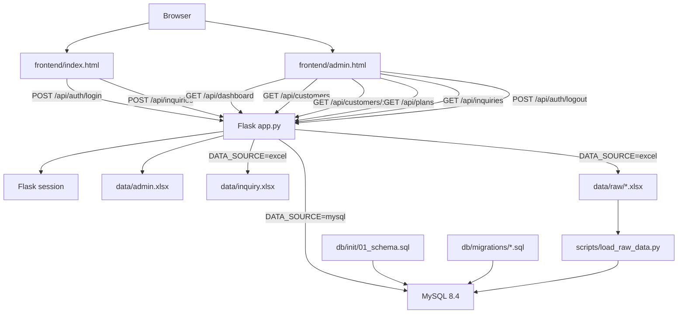
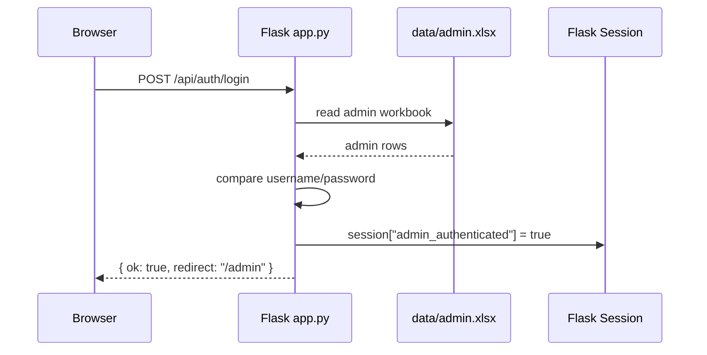
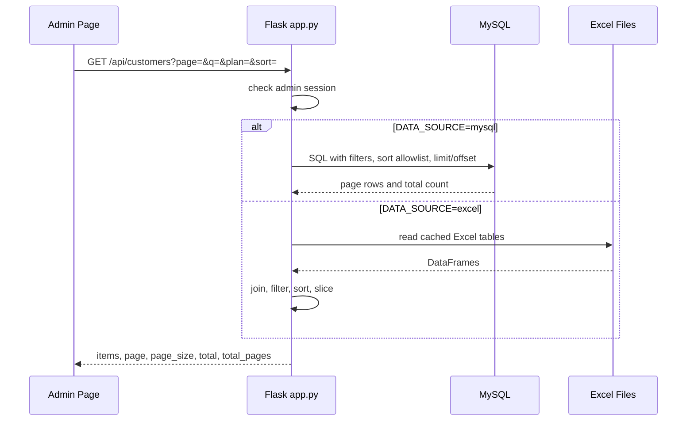
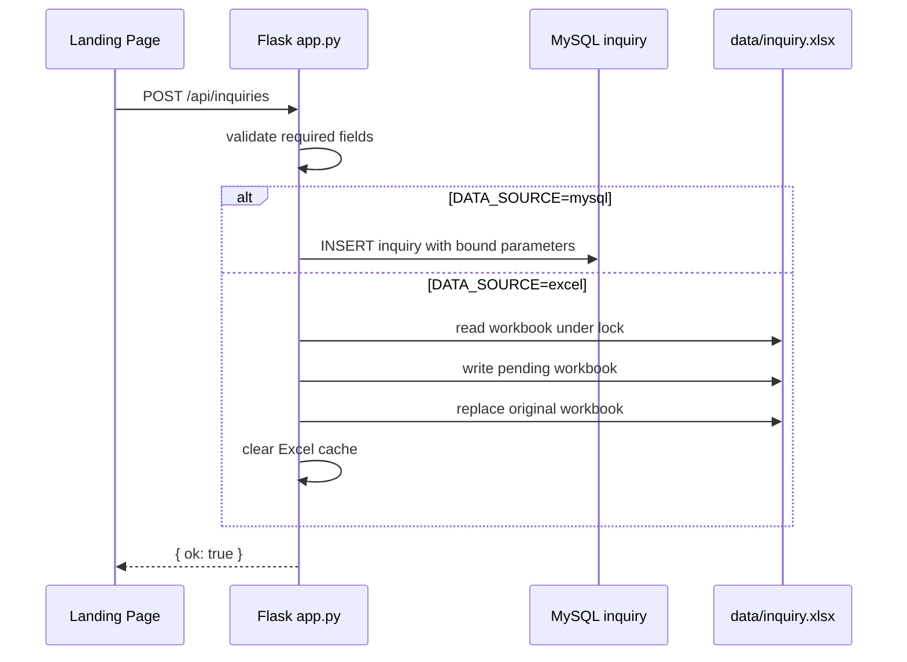

# CloudCare Backend Full Specification

이 문서는 현재 프로젝트의 실제 코드, 스키마, 설정 파일, 프론트엔드 호출부를 기준으로 작성한 백엔드 구조 설명서이다. 머신러닝 모델의 학습, 평가, 튜닝, 피처 엔지니어링 상세는 다루지 않는다. 다만 현재 웹 백엔드가 예측 결과나 위험도 데이터를 어떻게 취급하고 있는지, 향후 연결하려면 어떤 지점에 붙어야 하는지는 서비스 관점에서만 정리한다.

## 1. 백엔드 전체 개요

현재 프로젝트의 웹 백엔드는 단일 Flask 애플리케이션인 `app.py`가 담당한다. 별도의 Blueprint, ORM 모델 클래스, 서비스 계층 디렉터리는 없고, 라우트 함수와 데이터 접근 함수가 같은 파일 안에 배치되어 있다.

백엔드는 다음 두 가지 데이터 소스를 선택적으로 사용한다.

- MySQL 모드: `DATA_SOURCE=mysql`
- Excel 모드: `DATA_SOURCE=excel`

기본값은 MySQL이다. `.env`에 `DATA_SOURCE`가 없으면 `mysql`로 동작한다. 값이 `mysql` 또는 `excel`이 아니면 애플리케이션 import 시점에 `RuntimeError`가 발생한다.

웹 화면은 `frontend/index.html`과 `frontend/admin.html`을 Flask 템플릿으로 렌더링한다. 정적 파일 경로는 Flask의 `static_folder="frontend"`, `static_url_path="/static"` 설정을 통해 `/static/...` 형태로 제공된다.

## 2. 실행 구조

### 2.1 진입점

실행 진입점은 프로젝트 루트의 `app.py`이다.

```bash
uv run python app.py
```

서버는 다음 설정으로 실행된다.

```python
app.run(host="0.0.0.0", port=int(os.getenv("PORT", "5000")), debug=True)
```

즉 기본 포트는 `5000`이고, `PORT` 환경변수로 변경할 수 있다. 현재 코드는 `debug=True`로 실행되므로 운영 배포용 설정은 아니다.

### 2.2 Flask 앱 설정

`app.py`는 다음 방식으로 Flask 애플리케이션을 생성한다.

```python
app = Flask(
    __name__,
    template_folder="frontend",
    static_folder="frontend",
    static_url_path="/static",
)
```

세션 서명용 secret key는 다음 값을 사용한다.

```python
app.secret_key = os.getenv("FLASK_SECRET_KEY", "cloudcare-demo-secret")
```

`.env.example`에는 `FLASK_SECRET_KEY`가 포함되어 있지 않다. 따라서 별도 설정이 없으면 데모용 기본값이 사용된다.

### 2.3 환경변수 로딩

`app.py`는 프로젝트 루트의 `.env`를 로딩한다.

```python
ROOT = Path(__file__).resolve().parent
load_dotenv(ROOT / ".env", override=False)
```

`override=False`이므로 이미 OS 환경변수로 설정된 값은 `.env` 값으로 덮어쓰지 않는다.

## 3. 주요 파일과 역할

| 파일 | 역할 |
| --- | --- |
| `app.py` | Flask 앱, 라우트, 인증, Excel/MySQL 데이터 조회, 고객 목록/상세/문의 API |
| `frontend/index.html` | 랜딩 페이지, 관리자 로그인 모달, 공개 문의 폼 |
| `frontend/admin.html` | 관리자 대시보드, 고객 목록, 위험 고객 화면, 상세 화면, 전략 화면 |
| `frontend/logo.png` | `/static/logo.png`로 제공되는 로고 이미지 |
| `.env.example` | 실행 환경변수 예시 |
| `docker-compose.yml` | 로컬 MySQL 8.4 컨테이너 구성 |
| `db/init/01_schema.sql` | 원천 테이블 생성 SQL |
| `db/migrations/02_user_snapshot_target.sql` | 모델 타깃 테이블 생성 SQL. 현재 웹 API에서는 직접 사용하지 않음 |
| `db/migrations/03_web_admin_inquiry.sql` | 웹 로그인용 `admin`, 문의용 `inquiry` 테이블 생성 SQL |
| `db/migrations/04_customer_list_indexes.sql` | 고객 목록 조회 최적화용 복합 인덱스 SQL |
| `src/db.py` | SQLAlchemy MySQL 엔진 생성 유틸리티 |
| `src/data_loader.py` | MySQL 테이블을 pandas DataFrame으로 읽는 보조 유틸리티 |
| `src/schema.py` | `docs/raw_inventory.json` 기반 SQLAlchemy Core 테이블 메타데이터 |
| `scripts/load_raw_data.py` | Excel 원천 데이터를 검증 후 MySQL 빈 테이블에만 적재 |
| `scripts/load_user_snapshot_target.py` | 생성된 타깃 CSV를 검증 후 `user_snapshot_target`에 적재. 웹 백엔드 직접 호출 없음 |

## 4. 의존성과 기술 스택

`pyproject.toml` 기준 Python 버전은 다음과 같다.

```toml
requires-python = ">=3.12,<3.13"
```

웹 백엔드와 데이터 접근에 직접 관련된 주요 라이브러리는 다음과 같다.

- Flask: HTTP 라우팅, 템플릿 렌더링, 세션
- pandas: Excel 읽기, DataFrame 기반 조인/필터링, SQL 결과 처리
- SQLAlchemy: MySQL 연결, SQL 실행, 스키마 메타데이터
- PyMySQL: SQLAlchemy의 MySQL 드라이버
- python-dotenv: `.env` 로딩
- openpyxl: pandas Excel 입출력 엔진

`scikit-learn`, `numpy`, `matplotlib`, `jupyter`, `ipykernel`도 프로젝트 의존성에 포함되어 있지만 이 문서는 머신러닝 모델 내부 설명을 제외한다.

## 5. 데이터 소스 전환

### 5.1 전환 방식

데이터 소스는 `DATA_SOURCE` 환경변수로 결정된다.

```env
DATA_SOURCE=mysql
# DATA_SOURCE=excel
```

코드상 허용 값은 다음 두 개뿐이다.

```python
{"mysql", "excel"}
```

잘못된 값이면 서버 시작 전에 예외가 발생한다.

### 5.2 MySQL 모드

MySQL 모드에서는 원천 업무 테이블, 문의 테이블을 MySQL에서 읽는다. 단, 관리자 계정 정보는 현재 코드상 항상 `data/admin.xlsx`에서 읽는다.

MySQL 연결에는 `SQLAlchemy + PyMySQL`이 사용된다.

`app.py` 내부 `_get_engine()`은 다음 환경변수를 사용한다.

| 목적 | 환경변수 |
| --- | --- |
| 호스트 | `DB_HOST`, 없으면 `MYSQL_HOST`, 없으면 `localhost` |
| 포트 | `DB_PORT`, 없으면 `MYSQL_PORT`, 없으면 `3306` |
| 데이터베이스 | `MYSQL_DATABASE` |
| 사용자 | `MYSQL_USER`, 없으면 `DB_USER` |
| 비밀번호 | `MYSQL_PASSWORD`, 없으면 `DB_PASSWORD` |

`MYSQL_DATABASE`, 사용자, 비밀번호 중 하나라도 없으면 `RuntimeError`가 발생한다.

연결 URL은 다음 형태이다.

```text
mysql+pymysql://{user}:{password}@{host}:{port}/{db}?charset=utf8mb4
```

엔진은 `pool_pre_ping=True`로 생성된다.

### 5.3 Excel 모드

Excel 모드에서는 원천 데이터를 `data/raw/...` 아래의 Excel 파일에서 읽는다. `EXCEL_DATA_DIR`이 설정되어 있으면 해당 경로를 사용한다.

```env
DATA_SOURCE=excel
EXCEL_DATA_DIR=data/raw/cloudcare_v2_20260926_seed42
```

`EXCEL_DATA_DIR`이 없으면 `data/raw` 아래 디렉터리를 정렬한 뒤 가장 마지막 디렉터리를 선택한다.

Excel 모드 시작 시 `_validate_excel_files()`가 필요한 파일 존재 여부를 검사한다. 파일이 없으면 `RuntimeError`가 발생한다.

### 5.4 자동 fallback 없음

MySQL 연결 실패 시 Excel로 자동 전환되지 않는다. Excel 파일 누락 시 MySQL로 자동 전환되지도 않는다. 전환은 반드시 `DATA_SOURCE`로 명시해야 한다.

## 6. Excel 파일 매핑

`app.py`의 `FILES` 매핑은 다음과 같다.

| 논리 이름 | 파일명 |
| --- | --- |
| `user` | `5.1_user.xlsx` |
| `plan` | `5.2_plan.xlsx` |
| `subscription` | `5.3_subscription.xlsx` |
| `storage_usage_monthly` | `5.4_storage_usage_monthly.xlsx` |
| `user_activity_daily` | `5.5_user_activity_daily.xlsx` |
| `device` | `5.6_device.xlsx` |
| `payment_history` | `5.7_payment_history.xlsx` |
| `support_ticket` | `5.8_support_ticket.xlsx` |
| `subscription_event` | `5.9_subscription_event.xlsx` |

`5.10_user_snapshot_target.xlsx`는 웹 서비스의 `FILES` 매핑에 포함되어 있지 않다. 즉 현재 Flask API는 모델 타깃 파일이나 예측 결과 파일을 고객 목록 위험도에 직접 연결하지 않는다.

## 7. MySQL 스키마

### 7.1 원천 테이블

`db/init/01_schema.sql`은 다음 원천 테이블을 생성한다.

- `plan`
- `user`
- `device`
- `storage_usage_monthly`
- `subscription`
- `support_ticket`
- `user_activity_daily`
- `payment_history`
- `subscription_event`

모든 테이블은 InnoDB, `utf8mb4`, `utf8mb4_0900_ai_ci` 기준으로 생성된다.

### 7.2 주요 관계

| 자식 테이블 | FK | 부모 테이블 |
| --- | --- | --- |
| `device` | `user_id` | `user.user_id` |
| `storage_usage_monthly` | `user_id` | `user.user_id` |
| `subscription` | `user_id` | `user.user_id` |
| `subscription` | `plan_id` | `plan.plan_id` |
| `support_ticket` | `user_id` | `user.user_id` |
| `user_activity_daily` | `user_id` | `user.user_id` |
| `payment_history` | `subscription_id` | `subscription.subscription_id` |
| `subscription_event` | `user_id` | `user.user_id` |
| `subscription_event` | `subscription_id` | `subscription.subscription_id` |
| `subscription_event` | `old_plan_id` | `plan.plan_id` |
| `subscription_event` | `new_plan_id` | `plan.plan_id` |

### 7.3 웹 관리 테이블

`db/migrations/03_web_admin_inquiry.sql`은 웹 UI용 테이블을 생성한다.

`admin` 테이블:

- `admin_id`
- `username`
- `password`

초기 계정은 `admin / 1234`이다. 비밀번호는 해시가 아니라 평문으로 저장된다.

`inquiry` 테이블:

- `inquiry_id`
- `name`
- `email`
- `topic`
- `message`
- `status`
- `created_at`

문의 기본 상태는 `RECEIVED`이다.

### 7.4 인덱스

`01_schema.sql`과 `04_customer_list_indexes.sql`에는 고객 목록 조회를 위한 인덱스가 포함되어 있다. 특히 최신 구독, 최신 사용량, 최신 결제 조회에 사용되는 복합 인덱스가 중요하다.

- `ix_subscription_user_updated_id`
- `ix_storage_usage_monthly_user_month`
- `ix_payment_history_subscription_date_id`

`04_customer_list_indexes.sql`은 기존 인덱스를 drop하고 새 인덱스를 추가하는 형태이다. 현재 SQL은 모든 상황에서 반복 실행 가능한 완전 idempotent migration은 아니다. 이미 drop 대상 인덱스가 없거나 add 대상 인덱스가 있으면 MySQL에서 오류가 날 수 있다.

## 8. Docker 기반 MySQL

`docker-compose.yml`은 `mysql:8.4` 이미지를 사용한다.

서비스 이름은 `mysql`, 컨테이너 이름은 `cloudcare-mysql`이다.

포트 매핑은 다음과 같다.

```yaml
127.0.0.1:${DB_PORT:-3306}:3306
```

즉 외부 전체 인터페이스가 아니라 로컬호스트에만 바인딩된다.

초기화 SQL은 다음 경로로 컨테이너에 읽기 전용 마운트된다.

```yaml
./db/init:/docker-entrypoint-initdb.d:ro
```

MySQL 공식 이미지 특성상 이 초기화 SQL은 새 볼륨이 처음 생성될 때 실행된다. 이미 `mysql_data` 볼륨이 존재하면 `db/init/01_schema.sql` 변경사항이 자동 재실행되지 않는다.

실행 명령:

```bash
docker compose up -d
```

## 9. 데이터 적재 구조

### 9.1 원천 데이터 적재

`scripts/load_raw_data.py`는 Excel 원천 데이터를 읽고 검증한 뒤 MySQL에 적재한다.

핵심 정책은 다음과 같다.

- 먼저 Excel 원천 파일을 검증한다.
- DB 스키마를 검증한다.
- MySQL advisory lock `cloudcare_raw_load`를 획득한다.
- 테이블별 row count가 이미 있으면 해당 테이블은 건너뛴다.
- 비어 있는 테이블에만 insert한다.
- FK 부모 키 존재 여부를 insert 전에 확인한다.
- 전체 적재는 트랜잭션으로 보호된다.
- replace, truncate, delete를 수행하지 않는다.

검증만 실행하려면 다음 명령을 사용할 수 있다.

```bash
uv run python scripts/load_raw_data.py --validate-only
```

실제 적재:

```bash
uv run python scripts/load_raw_data.py
```

### 9.2 타깃 테이블 적재

`scripts/load_user_snapshot_target.py`는 `user_snapshot_target`용 CSV를 읽고 DB에 적재한다. 이 스크립트는 웹 백엔드 라우트에서 호출되지 않는다.

이 스크립트 역시 다음 정책을 가진다.

- 원천 `user`, `subscription` DB 내용이 Excel 입력과 같은지 검증한다.
- `user_snapshot_target` 테이블을 필요 시 생성한다.
- 테이블이 이미 차 있으면 insert를 건너뛴다.
- CSV와 DB 값을 reconciliation한다.
- 기존 원천 데이터는 건드리지 않는다.

웹 서비스 관점에서는 이 테이블이 현재 위험도 표시나 고객 목록에 연결되어 있지 않다.

## 10. 데이터 접근 함수

### 10.1 `_read(name)`

`_read()`는 논리 테이블 이름을 받아 pandas DataFrame으로 반환한다.

동작은 데이터 소스에 따라 다르다.

- `admin`: 항상 `data/admin.xlsx`에서 읽음
- `inquiry`: Excel 모드에서는 `data/inquiry.xlsx`, MySQL 모드에서는 MySQL `inquiry` 테이블에서 읽음
- 원천 업무 테이블: Excel 모드에서는 Excel 파일, MySQL 모드에서는 `pd.read_sql_table()` 사용

### 10.2 `_records(df)`

`_records()`는 DataFrame을 JSON 응답에 넣기 쉬운 record list로 변환한다.

처리 내용:

- `NaN`을 `None`으로 변환
- datetime 계열 값은 ISO 문자열로 변환

### 10.3 Excel 캐시

Excel 읽기에는 `functools.lru_cache`가 사용된다.

```python
@lru_cache(maxsize=16)
def _read_excel_cached(path: str, modified_ns: int) -> pd.DataFrame:
    ...
```

캐시 키에는 파일 경로와 수정 시각 nanosecond 값이 들어간다. 파일이 변경되면 mtime이 바뀌므로 새로 읽는다. 별도 TTL은 없다.

문의 Excel 저장 후에는 `_read_excel_cached.cache_clear()`를 호출한다.

### 10.4 고객 목록용 Excel 조인 캐시

Excel 모드의 고객 목록은 `_build_excel_customer_frame()`에서 여러 테이블을 조인해 만든다. 이 함수도 `lru_cache(maxsize=2)`로 캐시된다. 캐시 키는 관련 Excel 파일들의 mtime tuple이다.

사용되는 Excel 테이블:

- `user`
- `subscription`
- `plan`
- `storage_usage_monthly`
- `support_ticket`
- `payment_history`

결과에는 다음 성격의 필드가 만들어진다.

- 고객 기본 정보
- 최신 구독 정보
- 요금제명
- 최신 스토리지 사용량
- 문의 티켓 수
- 최신 결제 상태
- 화면 표시용 `customer_name`
- 위험도 `risk_level`

현재 `risk_level`은 예측 데이터가 연결되어 있지 않아 `None`이다.

## 11. 고객 목록 조회 구조

### 11.1 MySQL 목록 조회

MySQL 모드에서 `/api/customers`는 `_sql_customer_page()`를 사용한다. 이 함수는 전체 테이블을 pandas로 모두 가져오지 않고, SQL에서 필터링과 페이지네이션을 수행한다.

주요 특징:

- SQLAlchemy `text()` 기반 raw SQL 사용
- `ROW_NUMBER() OVER (...)`로 사용자별 최신 구독 선택
- `COUNT(*) OVER()`로 전체 건수 계산
- `LIMIT`, `OFFSET`으로 페이지 단위 조회
- 검색어는 bound parameter로 전달
- 정렬 컬럼은 allowlist로 제한

현재 허용 정렬 키는 다음과 같다.

- `user_id`
- `customer_name`
- `plan_name`
- `next_billing_date`
- `status`

UI에는 `storage_used_gb`, `usage_month`, `risk_level` 같은 컬럼 정렬 동작이 일부 존재하지만, 백엔드 allowlist에는 없다. 이 값들이 전달되면 백엔드는 기본적으로 `user_id` 기준 정렬로 처리한다.

### 11.2 Excel 목록 조회

Excel 모드에서는 `_customer_frame()`으로 전체 고객 프레임을 만든 뒤 pandas에서 필터링, 정렬, slicing을 수행한다.

처리 순서:

1. 고객 조인 프레임 생성
2. 검색어 필터
3. 요금제 필터
4. 위험도 필터
5. 정렬
6. page/page_size 기준 slicing

현재 위험도 데이터가 없으므로 `risk` 필터가 들어오면 결과가 비게 된다.

### 11.3 페이지 파라미터

`_page_params()`는 다음 규칙을 사용한다.

- `page`: 기본값 1, 최소 1
- `page_size`: 기본값 10, 최소 1, 최대 100

코드에는 `PAGE_SIZES = {10, 30, 50, 100}`가 정의되어 있고 UI도 이 네 가지를 제공하지만, 백엔드는 실제로는 1부터 100까지 허용한다.

## 12. 인증과 세션

관리자 인증은 Flask session을 사용한다.

로그인 성공 시 다음 값이 세션에 저장된다.

```python
session["admin_authenticated"] = True
```

보호되는 관리자 API는 이 값을 확인한다. 인증되지 않은 상태에서 API를 호출하면 `401` JSON 응답을 반환한다. `/admin` 페이지 접근 시에는 `/`로 redirect한다.

관리자 계정 데이터는 `data/admin.xlsx`에서 읽는다. `_ensure_workbooks()`는 파일이 없을 경우 다음 기본 계정을 생성한다.

- username: `admin`
- password: `1234`

현재 비밀번호 비교는 평문 비교이다. 비밀번호 해시, 계정 잠금, 로그인 실패 횟수 제한은 구현되어 있지 않다.

## 13. 문의 처리 구조

문의 등록 API인 `POST /api/inquiries`는 공개 API이다. 관리자 로그인 없이 호출할 수 있다.

필수 입력값:

- `name`
- `email`
- `topic`
- `message`

하나라도 비어 있으면 `400`을 반환한다.

### 13.1 Excel 모드 문의 저장

Excel 모드에서는 `data/inquiry.xlsx`를 읽고 다음 id를 계산한 뒤 행을 추가한다.

동시 저장 충돌을 줄이기 위해 `_inquiry_lock = threading.Lock()`을 사용한다. 저장은 임시 파일 `data/inquiry.pending.xlsx`에 먼저 쓴 뒤 `replace()`로 원본 파일을 교체한다.

저장 후 Excel read cache를 clear한다.

### 13.2 MySQL 모드 문의 저장

MySQL 모드에서는 다음 SQL 형태로 `inquiry` 테이블에 insert한다.

```sql
INSERT INTO inquiry (name, email, topic, message, status, created_at)
VALUES (:name, :email, :topic, :message, 'RECEIVED', NOW())
```

사용자 입력값은 bound parameter로 전달된다.

## 14. 라우트 목록

| Method | Path | 인증 | 설명 |
| --- | --- | --- | --- |
| `GET` | `/` | 불필요 | 랜딩 페이지 `index.html` 렌더링 |
| `GET` | `/admin` | 필요 | 관리자 페이지 `admin.html` 렌더링. 미인증 시 `/`로 redirect |
| `POST` | `/api/auth/login` | 불필요 | 관리자 로그인 |
| `POST` | `/api/auth/logout` | 세션 있으면 동작 | 세션 clear 후 로그아웃 |
| `GET` | `/api/dashboard` | 필요 | 고객 수, 활성 고객 수, 구독 고객 수, 문의 수 반환 |
| `GET` | `/api/customers` | 필요 | 고객 목록 검색, 필터, 정렬, 페이지네이션 |
| `GET` | `/api/plans` | 필요 | 요금제명 목록 반환 |
| `GET` | `/api/customers/<user_id>` | 필요 | 고객 상세 정보 반환 |
| `GET` | `/api/inquiries` | 필요 | 문의 목록 반환 |
| `POST` | `/api/inquiries` | 불필요 | 공개 문의 접수 |

## 15. API 상세

### 15.1 `POST /api/auth/login`

요청 JSON:

```json
{
  "username": "admin",
  "password": "1234"
}
```

성공 응답:

```json
{
  "ok": true,
  "redirect": "/admin"
}
```

실패 응답:

- 인증 실패: `401`
- 로그인 처리 중 예외: `500`

### 15.2 `POST /api/auth/logout`

세션을 clear한다.

응답:

```json
{
  "ok": true,
  "redirect": "/"
}
```

### 15.3 `GET /api/dashboard`

관리자 인증이 필요하다.

반환 필드:

- `total_customers`
- `active_customers`
- `subscribed_customers`
- `inquiries`

`active_customers`는 `user.status == "ACTIVE"` 기준이다. `subscribed_customers`는 고객 조인 프레임의 `status == "ACTIVE"` 기준이다.

### 15.4 `GET /api/customers`

관리자 인증이 필요하다.

쿼리 파라미터:

| 파라미터 | 설명 |
| --- | --- |
| `page` | 페이지 번호 |
| `page_size` | 페이지 크기 |
| `q` | 검색어 |
| `risk` | 위험도 필터. 현재 위험도 데이터가 없어 값이 있으면 결과 없음 |
| `plan` | 요금제명 필터 |
| `sort` | 정렬 키 |
| `direction` | `asc` 또는 `desc` |

응답 필드:

```json
{
  "items": [],
  "page": 1,
  "page_size": 10,
  "total": 0,
  "total_pages": 0,
  "risk_data_available": false
}
```

`risk_data_available`은 현재 항상 `false`이다.

### 15.5 `GET /api/plans`

관리자 인증이 필요하다. `plan` 테이블 또는 Excel 파일에서 `plan_name`을 읽어 중복 제거 후 정렬해서 반환한다.

응답:

```json
{
  "items": ["Basic", "Pro"]
}
```

### 15.6 `GET /api/customers/<user_id>`

관리자 인증이 필요하다.

MySQL 모드에서는 다음 데이터를 조회한다.

- 사용자 기본 정보
- 최신 구독
- 요금제
- 전체 스토리지 사용 이력
- 디바이스 목록
- 지원 티켓 목록
- 구독별 결제 이력

Excel 모드에서는 동일한 성격의 데이터를 각 Excel 파일에서 필터링해 구성한다.

사용자가 없으면 `404`를 반환한다.

### 15.7 `GET /api/inquiries`

관리자 인증이 필요하다. 문의 목록을 반환한다.

### 15.8 `POST /api/inquiries`

공개 문의 접수 API이다.

요청 JSON:

```json
{
  "name": "홍길동",
  "email": "user@example.com",
  "topic": "문의 주제",
  "message": "문의 내용"
}
```

성공 응답:

```json
{
  "ok": true
}
```

## 16. 프론트엔드와 백엔드 연결

### 16.1 랜딩 페이지

`frontend/index.html`은 Flask에서 `/`로 렌더링된다.

주요 백엔드 호출:

- 로그인 폼: `POST /api/auth/login`
- 문의 폼: `POST /api/inquiries`

로그인 성공 시 응답의 `redirect` 값 또는 `/admin`으로 이동한다.

문의 폼은 JSON으로 값을 전송하고 성공 시 사용자에게 접수 완료 메시지를 보여준다.

### 16.2 관리자 페이지

`frontend/admin.html`은 `/admin`에서 렌더링된다.

주요 백엔드 호출:

- 대시보드: `GET /api/dashboard`
- 고객 목록: `GET /api/customers`
- 요금제 필터: `GET /api/plans`
- 고객 상세: `GET /api/customers/<user_id>`
- 문의 목록: `GET /api/inquiries`
- 로그아웃: `POST /api/auth/logout`

프론트엔드 JavaScript는 대부분 HTML 파일 안에 inline으로 작성되어 있다. 별도의 `frontend/*.js` 파일 구조는 없다.

### 16.3 전략 화면

전략 화면의 고객별 전략 메모는 백엔드 DB에 저장되지 않는다. 브라우저 `localStorage`에 다음 형식의 key로 저장된다.

```text
eodirgaStrategy:{customerId}
```

따라서 브라우저나 사용자 환경이 바뀌면 전략 메모는 공유되지 않는다.

## 17. 모델 관련 데이터의 현재 연결 상태

현재 웹 백엔드는 머신러닝 모델의 점수, 확률, SHAP, metrics를 서비스 API에 연결하지 않는다.

구체적으로:

- `/api/customers`의 `risk_data_available`은 항상 `false`
- 고객 목록의 `risk_level`은 현재 `None`
- `risk` 필터가 들어오면 MySQL/Excel 모두 결과가 비게 됨
- 관리자 화면의 위험 고객 페이지는 위험도 데이터가 없다는 메시지를 표시하는 흐름을 가진다
- `user_snapshot_target` 관련 스크립트와 마이그레이션은 존재하지만 현재 Flask route에서 조회하지 않는다

따라서 향후 예측 결과를 연결하려면 고객 목록 생성 지점인 `_sql_customer_page()`, `_customer_frame()`, 고객 상세 API, 위험 고객 페이지 API 응답 구조를 함께 확장해야 한다.

## 18. 보안 특성

현재 구현의 보안 특성은 다음과 같다.

- `.env`, `.env.*`는 `.gitignore`에 포함되어 있다.
- Flask secret key는 환경변수 `FLASK_SECRET_KEY`로 설정할 수 있지만 기본값이 데모용 문자열이다.
- 관리자 비밀번호는 평문 저장 및 평문 비교이다.
- 로그인 실패 횟수 제한이 없다.
- CSRF 보호가 없다.
- SQL 사용자 입력값은 대체로 bound parameter로 전달된다.
- 고객 목록 정렬 컬럼은 allowlist로 제한된다.
- Flask debug mode가 켜진 상태로 실행된다.

현재 구조는 로컬 데모와 수업/프로젝트 검증 환경에 가까우며, 운영 배포 전에는 secret key, 비밀번호 해시, CSRF, HTTPS, debug 비활성화, 로그 정책, DB 계정 권한 분리 등이 필요하다.

## 19. 오류 처리와 장애 동작

| 상황 | 현재 동작 |
| --- | --- |
| `DATA_SOURCE` 값 오류 | import 시점 `RuntimeError` |
| Excel 모드 필수 파일 누락 | 시작 시 `_validate_excel_files()`에서 `RuntimeError` |
| MySQL 환경변수 누락 | `_get_engine()` 호출 시 `RuntimeError` |
| MySQL 연결 실패 | 자동 fallback 없음, 해당 요청 또는 시작 흐름 실패 |
| 미인증 API 호출 | `401` JSON |
| 미인증 `/admin` 접근 | `/` redirect |
| 로그인 실패 | `401` JSON |
| 로그인 처리 예외 | 로그 기록 후 `500` JSON |
| 문의 필수값 누락 | `400` JSON |
| 고객 상세 대상 없음 | `404` JSON |
| 고객 목록 결과 없음 | `items=[]`, `total=0` |

## 20. 로깅

현재 명시적인 로깅은 많지 않다.

- 로그인 처리 예외 시 `app.logger.exception("admin login failed")`
- 서버 시작 시 데이터 소스와 경로를 `print()`
- 데이터 적재 스크립트는 `[LOAD]`, `[SKIP]`, `[DONE]` 형태로 콘솔 출력

요청별 access log, structured logging, audit logging은 별도로 구현되어 있지 않다.

## 21. Mermaid Architecture Diagram



## 22. Mermaid Sequence Diagram

### 22.1 관리자 로그인



### 22.2 고객 목록 조회



### 22.3 공개 문의 접수



## 23. 운영 및 개발 실행 순서

### 23.1 Excel 모드

```bash
uv sync
```

`.env` 예시:

```env
DATA_SOURCE=excel
EXCEL_DATA_DIR=data/raw/cloudcare_v2_20260926_seed42
```

실행:

```bash
uv run python app.py
```

### 23.2 MySQL 모드

```bash
uv sync
docker compose up -d
uv run python app.py
```

필요 시 원천 데이터 적재:

```bash
uv run python scripts/load_raw_data.py --validate-only
uv run python scripts/load_raw_data.py
```

웹 관리 테이블이 없으면 `db/migrations/03_web_admin_inquiry.sql`을 MySQL에 적용해야 한다.

## 24. FAQ

### Q1. 백엔드 프레임워크는 무엇인가?

Flask이다. `app.py` 하나가 웹 서버, 템플릿 렌더링, API 라우팅, 인증, 데이터 접근을 담당한다.

### Q2. ORM을 사용하는가?

웹 라우트에서는 ORM 모델 클래스를 사용하지 않는다. MySQL 연결에는 SQLAlchemy 엔진을 쓰고, 일부 조회는 `pd.read_sql_table()`, 일부 조회는 SQLAlchemy `text()` raw SQL을 사용한다. 스키마와 적재 스크립트에서는 SQLAlchemy Core `Table`, `Column`, `metadata`를 사용한다.

### Q3. MySQL과 Excel은 어떻게 전환하는가?

`.env` 또는 OS 환경변수의 `DATA_SOURCE`로 전환한다. 허용 값은 `mysql`, `excel`이다.

### Q4. MySQL 장애 시 Excel로 자동 전환되는가?

아니다. 자동 fallback은 없다.

### Q5. 관리자 로그인 정보는 어디에 있는가?

현재 코드 기준으로는 `DATA_SOURCE`와 관계없이 `data/admin.xlsx`에서 읽는다. 파일이 없으면 `_ensure_workbooks()`가 `admin / 1234` 기본 계정을 생성한다.

### Q6. 문의 데이터는 어디에 저장되는가?

Excel 모드에서는 `data/inquiry.xlsx`에 저장된다. MySQL 모드에서는 `inquiry` 테이블에 저장된다.

### Q7. 고객 목록 위험도는 실제 모델 결과인가?

아니다. 현재 백엔드는 모델 예측 결과를 연결하지 않는다. `risk_data_available`은 항상 `false`이고, `risk_level`은 비어 있다.

### Q8. 고객별 전략 메모는 서버에 저장되는가?

아니다. `frontend/admin.html`의 JavaScript가 브라우저 `localStorage`에 저장한다.

### Q9. 페이지네이션은 서버에서 처리되는가?

MySQL 모드에서는 SQL의 `LIMIT/OFFSET`으로 서버 측 페이지네이션을 수행한다. Excel 모드에서는 pandas DataFrame에서 필터링 후 slice한다.

### Q10. Excel 읽기는 매 요청마다 파일을 다시 읽는가?

항상 그렇지는 않다. 파일 경로와 mtime을 키로 하는 `lru_cache`가 적용되어 있다. 파일 수정 시간이 바뀌면 새로 읽는다.

### Q11. Docker Compose를 켜면 스키마가 매번 재생성되는가?

아니다. MySQL 초기화 SQL은 새 볼륨이 처음 만들어질 때만 실행된다.

### Q12. 운영 배포 준비가 되어 있는가?

현재 상태는 로컬 데모/프로젝트 검증용에 가깝다. 운영 배포 전에는 `debug=False`, 강한 `FLASK_SECRET_KEY`, 비밀번호 해시, CSRF 보호, 운영용 WSGI 서버, 로깅/모니터링, DB 권한 분리 등이 필요하다.

