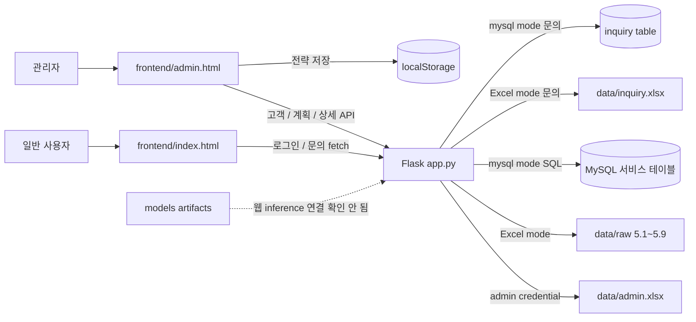

# 프론트엔드 및 화면 연동 작업 보고서

> 작성 기준: 2026-09-26 현재 working tree. 이 문서는 화면 코드, Flask route, SQL schema/migration, 환경설정, 데이터 파일을 확인해 현재 동작을 정리했다. 과거 작업 이력은 현재 코드·주석·기존 문서로 확인할 수 있는 범위에서만 기재했으며, Git commit 이력은 확인 가능한 기록이 없는 것으로 간주하고 판단 근거로 사용하지 않았다.

## 1. 요약

프로젝트는 Flask가 `frontend/index.html`과 `frontend/admin.html`을 제공하는 단일 웹 애플리케이션이다. 메인 소개 페이지와 관리자 화면은 존재하고, 관리자 로그인과 고객 목록은 Flask API로 연결되어 있다. 기본 데이터 소스는 `DATA_SOURCE` 환경변수이며 현재 코드의 기본값은 `mysql`이다. 관리자 자격 증명은 별도 예외로 `data/admin.xlsx`를 읽는다.

고객 목록은 MySQL SQL 단계에서 페이지 크기와 offset을 적용한다. 한 쿼리에서 최신 구독을 붙이고 `COUNT(*) OVER()`로 total을 산출한다. 반면 위험 고객 API 조회는 현재 위험도 모델이 없다는 이유로 빈 결과를 돌려준다. 대시보드 KPI와 일부 상세 차트·위험 설명은 정적 예시 또는 TODO이며, 모델 결과를 보여주는 실제 연동은 확인되지 않았다. 대응 전략 저장은 브라우저 `localStorage` 기반이며 서버나 MySQL에 저장하지 않는다.

## 2. 화면 현황

| 화면 | 역할 | 구현 상태 | 관련 파일 | 연결되는 Backend |
|---|---|---|---|---|
| 메인 페이지 | 서비스 소개, 로그인 진입, FAQ, 문의 | 화면 구현. 문의 제출은 API 연결. 소개 문구와 계산 UI는 정적/브라우저 계산 | `frontend/index.html` | `/`, `POST /api/auth/login`, `POST /api/inquiries` |
| 관리자 로그인 | 사용자명·비밀번호 확인 및 관리자 세션 설정 | 구현. `admin.xlsx` 확인 후 Flask session 설정 | `frontend/index.html`, `app.py` | `POST /api/auth/login` |
| 관리자 대시보드 | 고객 수·활성·가입·위험 신호 등 요약 표시 | 화면 부분 구현. KPI API route는 있으나 화면이 그 API를 호출하는 연결은 확인되지 않음. 여러 카드가 정적 예시 | `frontend/admin.html`, `app.py` | `GET /api/dashboard`는 존재하나 dashboard 화면 fetch 미확인 |
| 전체 고객 조회 | 고객 기본 정보 목록, 검색·요금제 필터·페이지 이동 | 목록 API 및 UI 연동. 실제 고객 기본값은 MySQL | `frontend/admin.html`, `app.py` | `GET /api/customers` |
| 위험 고객 조회 | 위험 고객 표 표시 | 화면 및 호출 코드는 있으나 위험 모델/API 데이터는 미구현. `risk=HIGH` 요청은 백엔드에서 빈 목록을 반환 | `frontend/admin.html`, `app.py` | `GET /api/customers?risk=HIGH` (현재 빈 결과) |
| 고객 상세 | 선택 고객의 요약 및 상세 자료 | API 조회 경로 존재. 화면에는 일부 고정 차트·TODO가 남아 있어 API payload 전체를 UI에 매핑했다고 볼 수 없음 | `frontend/admin.html`, `app.py` | `GET /api/customers/{user_id}` |
| 고객 대응 전략 | 고객 선택, 전략/상태/메모 입력, 저장 | 화면 동작 구현. 고객 목록은 위험 고객 API에 의존하나 해당 API가 현재 빈 목록을 반환. 저장은 `localStorage` | `frontend/admin.html` | 고객 목록/상세 API 호출. 전략 CRUD backend 없음 |
| 모델/데이터 | 모델 상태·지표 안내 | 화면은 있으나 모델 결과는 연결되지 않음. “연결 예정”·대시보드형 정적 설명 표시 | `frontend/admin.html` | 모델 예측 API 없음 |
| FAQ | 일반 사용자 질문 안내 | 정적 콘텐츠로 구현 | `frontend/index.html` | 없음 |
| 문의 | 일반 사용자 문의 접수 | 입력 검증과 API 전송 handler 존재. 접수 데이터는 `DATA_SOURCE`에 따라 Excel 또는 MySQL `inquiry` 경로 | `frontend/index.html`, `app.py` | `POST /api/inquiries`; 관리자 조회 `GET /api/inquiries` |

## 3. 사용 기술과 실제 사용 위치

| 기술 | 프로젝트 내 사용 방식 |
|---|---|
| HTML | `frontend/index.html`, `frontend/admin.html`에 각 화면의 구조와 콘텐츠를 작성. 별도 templates/static 디렉터리 대신 Flask가 이 디렉터리를 template/static 양쪽으로 사용 |
| CSS | 두 HTML 파일의 inline `<style>` 및 페이지 내부 스타일 블록에 레이아웃, 반응형 UI, 컬러, 애니메이션 정의 |
| JavaScript | 페이지 전환, 대화상자, 입력 검증, fetch 호출, 목록 렌더링, 페이지네이션, 필터, 고객 상세 연동, 전략 저장을 구현 |
| Flask / Python | `app.py`에서 HTML route와 JSON API 제공, 로그인 세션, 데이터 소스 선택, MySQL·Excel 접근 처리 |
| Jinja2 | Flask `render_template()`로 `index.html`, `admin.html` 제공. 화면 템플릿 안에 복잡한 Jinja 반복/조건 표현은 거의 없고 HTML/JS 중심 |
| Fetch / JSON | 로그인, 문의, 고객 목록, 고객 상세, 요금제 옵션, 전략 후보 목록 조회에 사용 |
| MySQL | `DATA_SOURCE=mysql`일 때 서비스 데이터의 주 데이터 저장소. 고객 목록은 SQL query, 상세는 SQL query, 문의는 inquiry table 사용 |
| SQLAlchemy | `_get_engine()`에서 MySQL engine 생성, `text()` SQL 실행, `read_sql_table/read_sql_query`의 DB 연결에 사용. 테이블 metadata/스키마도 프로젝트의 `src/schema.py`에 정의 |
| PyMySQL | SQLAlchemy URL의 MySQL DBAPI driver (`mysql+pymysql`) |
| pandas | Excel 읽기 및 프레임 병합, 레코드 JSON 변환, Excel 문의 저장, 일부 DB 전체 프레임 조회에 사용 |
| openpyxl | pandas의 xlsx 엔진 의존성으로 설치되어 있고 데이터 생성/검증 스크립트에서도 직접 사용. `app.py`는 `pd.read_excel/to_excel` 경로를 사용 |
| python-dotenv | `app.py`에서 `.env`를 읽고 DB·Flask 설정에 반영 |
| localStorage | 고객별 대응 전략 입력값 저장. 서버 영속 저장이 아니며 브라우저/출처 단위 |
| CSS animation / IntersectionObserver | 메인 hero/장식 애니메이션 및 관리자 화면의 노출 애니메이션·페이지 진입 효과 |

프로젝트 의존성은 `pyproject.toml`에 정의되어 있다. 별도 프론트엔드 빌드 도구나 SPA 프레임워크 사용은 확인되지 않았다.

## 4. 현재 폴더 구조 중 화면 연동 관련 항목

```text
project/
├─ app.py                         # Flask 화면 route, 인증, API, DB/Excel 연결
├─ frontend/
│  ├─ index.html                  # 일반 사용자 메인·로그인 대화상자·FAQ·문의
│  ├─ admin.html                  # 관리자 대시보드·고객·상세·전략·모델 화면
│  └─ logo.png                    # Flask static URL로 제공되는 로고/로딩 이미지
├─ data/
│  ├─ admin.xlsx                  # 관리자 로그인 정보
│  ├─ inquiry.xlsx                # Excel 모드 문의 저장소(생성 대상)
│  ├─ raw/                        # 5.1~5.9 합성 원천 Excel
│  └─ processed/                  # 분석/가공 산출물 저장 위치
├─ db/
│  ├─ init/01_schema.sql          # 원천 테이블 및 인덱스 DDL
│  └─ migrations/                 # target, web inquiry, 고객 목록 인덱스 migration
├─ src/
│  ├─ schema.py                   # SQLAlchemy 테이블 명세 및 파일/컬럼 매핑
│  ├─ db.py                       # 공용 DB engine 설정(데이터 작업 코드)
│  ├─ snapshot_schema.py          # user_snapshot_target 테이블 정의
│  └─ data_loader.py              # 원천 테이블 로딩 도우미
├─ scripts/                       # 원천 생성·재생성·적재·분석 및 EDA 코드
├─ models/                        # 전처리 artifact가 있으나 웹 예측 연동 코드 확인 안 됨
├─ tests/                         # 데이터/재생성/target 테스트
├─ .env.example                   # 환경변수 예시
├─ docker-compose.yml             # 로컬 MySQL 서비스 설정
└─ pyproject.toml                 # Python 의존성 및 프로젝트 설정
```

원천 파일이 실제로 존재하는 하위 폴더는 `data/raw/cloudcare_20260831_seed42/`이다. `app.py`는 `data/raw` 아래 첫 번째 디렉터리를 `RAW_DIR`로 사용한다. 따라서 여러 raw 하위 폴더를 병렬로 둘 경우 첫 번째 디렉터리 선택이 의도한 데이터셋과 다를 수 있다.

## 5. 메인 페이지

`frontend/index.html`은 제품 소개용 화면이다. 브랜드 문자열 `어딜가`, 클라우드 고객 이탈 관리/예측 소개, Hero 일러스트, 주요 문제·기능 섹션, 이용 흐름, 절감액 계산 UI, FAQ, 문의 폼, 관리자 로그인 대화상자가 코드에 있다.

Hero와 카드에는 CSS keyframes 및 IntersectionObserver 기반 reveal 효과가 사용된다. 절감액 계산기는 브라우저에서 입력값을 계산해 표시하며, 모델 결과를 호출하는 것으로 확인되지는 않았다. D-60·예측 관련 문구는 서비스 설명/화면 콘텐츠이며, 이를 실제 예측값으로 계산하는 route는 없다.

FAQ는 정적 질문/답변 콘텐츠다. 문의 폼의 최종 submit handler는 `POST /api/inquiries`에 JSON을 보내고 성공/오류 문구를 표시한다. HTML에는 초기 버전 안내용 submit handler가 한 번 등록되어 있다가 뒤 스크립트에서 같은 폼에 실제 fetch handler가 추가되는 구조도 확인된다. 두 handler 모두 `preventDefault()`를 호출하므로 입력 제출은 API handler가 담당하지만, 구형 안내 handler는 중복 코드로 정리 대상이다.

로그인 대화상자는 `POST /api/auth/login`을 호출한다. 응답 Content-Type을 확인한 뒤 JSON이 아닐 때 사용자 친화 메시지를 표시하고, 성공 시 서버가 준 `/admin`으로 이동한다.

## 6. 관리자 로그인 및 세션

`app.py`의 `login()`은 JSON body에서 `username`, `password`를 읽고 `_ensure_workbooks()` 이후 `_read("admin")`으로 관리자 목록을 읽는다. `_read()`는 `name == "admin"`이면 데이터 소스 설정과 무관하게 `data/admin.xlsx`를 `pandas.read_excel()` 경로로 읽는다. 일치하는 행이 있으면 Flask `session["admin_authenticated"] = True`를 설정하고 `{ok: true, redirect: "/admin"}` JSON을 돌려준다. 불일치 응답은 JSON HTTP 401이다. 내부 예외는 로그를 남기고 JSON HTTP 500을 돌려준다.

`/admin`, `/api/dashboard`, `/api/customers`, `/api/plans`, `/api/customers/{user_id}`, `/api/inquiries`에는 세션 로그인 검사가 있다. Flask 세션은 기본적으로 서명된 쿠키 방식이다. 다만 코드의 기본 `FLASK_SECRET_KEY`는 개발용 문자열 `cloudcare-demo-secret`이며, `admin.xlsx`가 없으면 `_ensure_workbooks()`가 `admin / 1234` 계정을 생성한다. 따라서 현재 구현은 프로젝트 데모 수준이며 운영 환경용 인증(비밀번호 해시, 계정 관리, CSRF/로그인 제한, 강한 secret 관리)을 갖췄다고 볼 수 없다.

`POST /api/auth/logout`은 `session.clear()`를 호출하지만 관리자 HTML에서 이 endpoint를 호출하는 fetch/UI는 확인되지 않았다.

## 7. 관리자 대시보드

`admin.html`에는 KPI 카드, 우선 확인 위험고객 샘플, 최근 신호 카드가 있다. HTML 초기 콘텐츠에 “위험 고객”, 퍼센트, 감소량 등이 고정 값으로 들어간다. 관리자 화면 초기 스크립트의 `animateVisiblePage()`도 차트/숫자 애니메이션을 수행하지만 실제 차트 라이브러리나 대시보드 API fetch를 확인하지 못했다.

Backend에는 `GET /api/dashboard`가 있다. `_customer_frame()`에서 고객·구독·요금제·사용량·문의·결제 정보를 모은 뒤 전체/활성/구독 고객과 문의 수를 JSON으로 계산한다. MySQL 모드에서는 `u.*` 및 사용량/티켓 집계를 포함하는 넓은 query가 전체 사용자에 대해 실행된다. 현재 관리자 화면이 이 endpoint를 호출하지 않으므로 대시보드 HTML의 수치들을 이 JSON으로 표시한다고 말할 수 없다. 위험 점수·등급·확률·Top 요인은 실제 모델 출력이 아닌 예시 또는 TODO다.

## 8. 전체 고객 조회와 성능

### 데이터와 Backend query

고객 데이터는 `DATA_SOURCE=mysql`이면 MySQL의 `user`, 최신 `subscription`, `plan`을 기준으로 조회한다. `app.py`의 `_sql_customer_page()`는 `ranked_subscription` CTE에서 사용자별 `updated_at DESC, subscription_id DESC` 순으로 최신 구독을 정하고, `filtered_users`에서 user·subscription·plan을 연결한다. `page_users`에서 `COUNT(*) OVER()`와 `LIMIT :limit OFFSET :offset`을 적용한다. 따라서 전체 고객 행을 Python/Pandas에 먼저 로드한 후 잘라내는 방식이 아니다.

조회 파라미터는 `page`, `page_size`, `q`, `risk`, `plan`, `sort`, `direction`이다. `_page_params()`는 page 하한을 1로 제한하고 page size를 1~100으로 제한한다. 기본 크기는 10이며 화면 선택지는 10/30/50/100이다. API 응답의 `total_pages`는 `(total + page_size - 1) // page_size`로 계산된다. total은 별도의 COUNT 쿼리가 아니라 같은 SQL의 window count로 구한다. page 결과가 0행이면 total은 현재 코드상 0이다.

검색은 SQL WHERE에서 사용자 ID 문자열, `고객 {user_id}` 문자열, `plan_name`에 `%검색어%`를 적용한다. 요금제 선택은 `p.plan_name = :plan_name` 조건이다. 위험 필터가 들어오면 현재 모델 데이터가 없으므로 즉시 `([], 0)`을 반환한다.

현재 API 정렬 allowlist는 `user_id`, 고객명(ID 정렬과 동일), `plan_name`, `next_billing_date`, `status`만 허용한다. 화면의 정렬 header mapping은 일부 오래된 컬럼명(`storage_used_gb`, `usage_month`, `risk_level`)을 여전히 전송하지만 backend allowlist 밖이면 `user_id`로 fallback 된다. UI의 정렬 affordance는 있어도 그 컬럼 정렬은 실질 적용되지 않는다.

### Frontend pagination

`admin.html` 고객 목록 스크립트는 `page`, `totalPages`, `requestNo`, `sort`, `direction`을 유지한다. 각 요청은 `URLSearchParams`를 이용해 `/api/customers`를 호출한다. 이전/다음, 첫/마지막 및 현재 페이지 주변 번호를 버튼으로 만든다. 사용자 검색은 400ms debounce 후 page 1부터 요청한다. plan/risk/page size 변경도 page를 1로 리셋한다. 응답 번호 `requestNo`를 비교해 이전 요청 응답이 새 요청을 덮어쓰는 것을 막는다.

프론트는 API가 반환한 현재 페이지 items만 DOM에 렌더링한다. 기본 화면에 서버 총건수와 페이지 수를 별도 텍스트로 표시하지는 않지만 pagination 버튼 계산에 `total_pages`를 사용한다.

### 적용된 최적화와 남은 비용

적용된 항목은 SQL `LIMIT/OFFSET`, 제한된 목록 필드, 위험/사용량/문의/결제 상세 조회를 목록 query에서 제외, 별도 COUNT 대신 window count, 사용자별 최신 구독 인덱스, 검색 debounce, 이전 fetch 응답 무시다.

다만 SQL은 최신 구독을 `ROW_NUMBER()`로 순위화하기 위해 subscription 전체를 고려하고, `%term%` 검색은 일반 B-tree 인덱스로 효율적인 prefix seek가 어렵다. `COUNT(*) OVER()`는 전체 필터 결과 수를 계산해야 해 쿼리의 work 자체를 없애지는 않는다. OFFSET이 커질수록 건너뛸 행 처리가 늘 수 있다. 대량 데이터에서 실제 `EXPLAIN ANALYZE`와 workload 측정이 추가로 필요하다.

## 9. 위험 고객 조회

위험 화면은 `riskTable`로 존재하고 페이지당 10명을 요청한다. 검색 입력에는 400ms debounce가 있으며 이전 응답 차단용 `request` 카운터도 있다. 화면은 위험 점수, 이유, 사용량 변화, 다음 청구, 추천 항목을 렌더링하도록 작성되어 있다.

하지만 현재 `_sql_customer_page()`는 `risk` 파라미터가 있으면 즉시 빈 결과와 total 0을 반환한다. 모델의 `prediction`, `churn_probability`, `risk_level`, feature explanation을 읽거나 위험 순으로 정렬하는 backend route/테이블은 확인되지 않았다. 그러므로 현재 위험 화면은 데이터 미연동 상태이며, HTML 초기 예시나 테이블 메시지를 실제 위험 고객 결과로 해석하면 안 된다.

## 10. 고객 상세

분석 버튼은 `loadDetail()`에서 `data-user-id`를 읽어 `GET /api/customers/{user_id}`를 호출한다. 성공 시 `setDetail()`이 이름·ID·제목·badge·전략 버튼의 `data-user-id`를 설정한다.

MySQL 상세 endpoint는 고객 기본값, 최신 구독과 요금제 이름/한도, 사용량 이력, 기기, 지원 티켓, 구독에 연결된 결제 이력을 반환한다. SQL은 user ID 조건을 사용하고 사용량·기기·티켓은 각자 사용자 ID로 조회한다. 결제는 subscription을 통해 사용자를 연결한다. 이 route는 별도 활동 일별 목록이나 subscription_event를 payload에 포함하지 않는다. Excel fallback에서는 `_customer_frame()`의 한 행과 usage/device/tickets를 반환하고 payments 배열은 별도 추가하지 않는다.

화면에 기본 제공된 상세 layout의 최근 6개월 chart path, 위험 점수 ring, 요인 막대는 정적 markup이다. 실제 값으로 chart를 업데이트하는 코드가 확인되지 않아 해당 시각화가 DB 상세값을 반영한다고 볼 수 없다. 상세 API는 데이터 제공 경로는 갖추었지만 화면 표시 매핑은 부분 구현이다.

## 11. 고객 대응 전략

대상 고객 후보는 `loadStrategyUsers()`가 `/api/customers?page=1&page_size=100&risk=HIGH`를 호출하고 모든 페이지를 이어 읽는 구조다. 따라서 일반 메뉴 진입 시 의도된 후보는 HIGH 위험 고객이다. 현재 backend risk filter가 빈 배열을 반환하므로 후보도 비어 있게 된다.

고객 상세에서 전략 버튼을 누르면 상세 페이지의 `data-user-id` 또는 `window.selectedCustomerState.selected.user_id`를 이용해 `loadStrategyUsers(id)`를 호출한다. 해당 고객이 후보에 없으면 상세 API로 읽어 후보 목록에 추가한다. 후보 option이 생성되면 고객 ID가 일치하는 경우 hidden input 및 label을 설정하고 자동 선택한다. 전달 수단은 URL parameter나 backend session이 아니라 JS 전역 state, DOM `data-user-id`, hidden input 및 API 호출이다.

저장은 `localStorage`의 `eodirgaStrategy:{id}` 키로 strategy type/status/memo/time을 기록한다. 서버 저장 API는 없다. 초기 스크립트에 `loadStrategy()`, 또 다른 전략 전용 handler, 중복 save listener가 남아 있어 전략 상태 관리가 여러 블록에 분산되어 있다.

취소 동작은 `resetStrategySelection()`과 `resetStrategyForm()`으로 hidden customer, `selected`, `pendingStrategyUserId`, label, 검색어, customer option active, 기본 전략·상태·메모를 초기화하도록 작성되어 있다. 상세 자동 선택을 담당하는 두 callback은 비동기 응답 이후 현재 selected와 pending ID를 확인한다. 다만 상세 화면의 `data-user-id` 자체는 취소 시 초기화되지 않고, 상세 진입 listener가 이를 fallback으로 읽을 수 있다. 따라서 취소 후 상세 페이지에서 다시 전략으로 진입하는 경로는 상태/DOM 값을 함께 검증할 필요가 있다. 취소는 브라우저에 이미 저장한 전략을 삭제하지 않는다.

## 12. Excel 사용 현황

| Excel 파일 | 용도 | 읽는 코드 | 사용 화면 | MySQL 적재 여부 |
|---|---|---|---|---|
| `data/admin.xlsx` | 관리자 ID/PW 확인. 파일이 없으면 기본 demo 계정 생성 | `_ensure_workbooks()`, `_read("admin")`, `pd.read_excel()` 캐시 | 로그인 | 로그인 정보는 이 코드 경로에서 MySQL로 적재하지 않음 |
| `data/inquiry.xlsx` | `DATA_SOURCE=excel`일 때 문의 목록/접수 저장 | `_read("inquiry")`, `pd.read_excel()`, 문의 POST 시 `to_excel()` | 문의 관리자 조회/접수(Excel 모드) | 별도 적재 여부는 앱 코드에서 확인되지 않음 |
| `data/raw/<dataset>/5.1_user.xlsx` | user 원천 | `_read("user")`, `pd.read_excel()`; 생성·적재 스크립트도 사용 | Excel 데이터 소스의 관리자 화면 | 전용 raw loader가 MySQL 적재. 앱 실행 시 자동 적재하지 않음 |
| `5.2_plan.xlsx`~`5.9_subscription_event.xlsx` | 요금제 및 고객 관련 원천 8종 | `_read()`/`_build_excel_customer_frame()` 등 Excel 모드 | 요금제 옵션, 고객/상세 Excel fallback | 전용 raw loader가 MySQL 적재. 앱 실행 시 자동 적재하지 않음 |
| `5.10_user_snapshot_target.xlsx` | 레이블/EDA target 원천 | `app.py` 고객 화면 경로에서 읽지 않음 | 웹 화면 연결 확인 안 됨 | 별도 target 적재 도구가 있음 |
| 모델 결과 Excel | 웹 화면에서 읽는 모델 결과 파일 | 코드상 확인되지 않음 | 없음 | 해당 없음 |

현재 코드의 raw 파일 선택은 `RAW_DIR` 하위 첫 디렉터리와 `FILES` mapping으로 정해진다. 파일 경로별 읽기 캐시 `_read_excel_cached(path, mtime_ns)`는 같은 파일 변경 시각에 대해 재사용한다. `_build_excel_customer_frame`도 계산 결과를 캐시한다.

## 13. MySQL 연동 현황

### 연결 설정

`app.py`는 프로젝트 `.env`를 `load_dotenv(..., override=False)`로 읽는다. `_get_engine()`은 우선 `DB_HOST`/`DB_PORT`를 읽고 없으면 `MYSQL_HOST`/`MYSQL_PORT`, DB 이름은 `MYSQL_DATABASE`, 계정은 `MYSQL_USER` 또는 `DB_USER`, 비밀번호는 `MYSQL_PASSWORD` 또는 `DB_PASSWORD`에서 선택한다. 기본 host/port fallback은 `localhost:3306`이다. SQLAlchemy URL은 `mysql+pymysql`이고 `pool_pre_ping=True`를 사용한다. `@lru_cache(maxsize=1)`로 engine을 재사용한다.

`DATA_SOURCE` 기본값은 현재 `mysql`; `excel`은 Excel service data 경로다. 관리자 계정은 `DATA_SOURCE` 값과 관계없이 Excel이다. MySQL 연결 오류 때 Excel로 자동 전환하지 않는다. 실제 `.env`의 비밀번호 등 secret은 이 문서에 복사하지 않는다.

앱은 SQLAlchemy engine과 `text()` 기반 SQL을 함께 사용한다. 즉 SQLAlchemy를 사용하지만 화면 API의 query는 명시적 SQL이다. 스키마 선언은 별도 `src/schema.py` 및 `db/init/01_schema.sql`에 있다.

### 테이블

`db/init/01_schema.sql`에서 확인한 원천 테이블은 `user`, `plan`, `subscription`, `storage_usage_monthly`, `user_activity_daily`, `device`, `payment_history`, `support_ticket`, `subscription_event`이다. `db/migrations/02_user_snapshot_target.sql`은 `user_snapshot_target`, `03_web_admin_inquiry.sql`은 `admin`과 `inquiry`를 정의한다. `admin` migration은 있으나 현재 로그인 코드는 그 테이블이 아니라 `admin.xlsx`를 사용한다. `04_customer_list_indexes.sql`은 세 복합 인덱스 migration이다.

정의된 테이블이 현재 연결된 실제 DB에 모두 존재하는지는 이번 조사 시점에 확인하지 못했다. `.env` 설정을 사용해 `localhost` MySQL에 read-only 접속을 시도했지만 TCP connection refused가 발생했다. 따라서 아래 목록은 DDL/migration 상 정의 여부이며, 실제 DB의 table/index 적용 상태는 확인되지 않았다. 과거 실행 시 연결 가능했더라도 이번 현재 상태 확인을 대체하지 않는다.

## 14. Frontend ↔ Flask ↔ 데이터 흐름

### 전체 고객 목록

```text
admin.html 목록 스크립트
  → GET /api/customers?page=...&page_size=...&q=...&plan=...
  → Flask customers() / _sql_customer_page()
  → MySQL user + 최신 subscription + plan
  → SQL LIMIT/OFFSET 및 COUNT(*) OVER()
  → JSON items/total/page/total_pages
  → 현재 페이지 행을 HTML table에 렌더링
```

### 위험 고객

```text
admin.html riskTable 스크립트
  → GET /api/customers?risk=HIGH&page=...
  → Flask customers() / _sql_customer_page()
  → risk 값이 있으면 현재는 빈 items, total=0
  → 화면의 데이터 없음 메시지
```

### 고객 상세

```text
분석 버튼(user_id)
  → GET /api/customers/{user_id}
  → Flask customer_detail()
  → MySQL user / 최신 subscription / plan / usage / device / ticket / payment query
  → JSON data
  → loadDetail() / setDetail()로 선택 고객 일부 표시 및 전략 버튼에 ID 설정
```

### 대응 전략

```text
전략 메뉴 진입 또는 상세의 전략 버튼
  → loadStrategyUsers()가 GET /api/customers?risk=HIGH 페이지별 호출
  → 선택 ID가 후보 밖이면 GET /api/customers/{id}
  → dropdown option/hidden input/label 설정
  → 사용자가 type/status/memo 입력
  → localStorage eodirgaStrategy:{user_id}에 저장
```

전략 값 자체는 Flask나 MySQL에 전달되지 않는다. 후보 고객 API가 비어 있으면 메뉴에서 선택 가능한 실제 고객 후보도 채워지지 않는다.

### 관리자 로그인

```text
index.html login form
  → POST /api/auth/login JSON
  → Flask login() / _read("admin")
  → data/admin.xlsx 조회
  → 일치하면 Flask session cookie 설정, JSON redirect 반환
  → fetch가 JSON Content-Type 확인 후 /admin 이동
```

### 문의

```text
index.html contact form
  → POST /api/inquiries JSON
  → 필수값 검사
  → DATA_SOURCE=excel이면 inquiry.xlsx append/to_excel
     DATA_SOURCE=mysql이면 inquiry table INSERT
  → JSON ok
```

관리자 문의 조회 API는 `GET /api/inquiries`지만 현재 admin.html에서 호출하는 UI 경로는 확인되지 않았다.

## 15. Flask route / API 목록

| Method | URL | 입력 | 동작/반환 | 보호 및 화면 |
|---|---|---|---|---|
| GET | `/` | 없음 | 메인 HTML | 공개 메인 |
| GET | `/admin` | session cookie | 인증 시 관리자 HTML, 아니면 `/` redirect | 관리자 로그인 필요 |
| POST | `/api/auth/login` | JSON username/password | 성공 `{ok, redirect}`; 실패 JSON 401; 내부 오류 JSON 500 | 로그인 화면 |
| POST | `/api/auth/logout` | session cookie | 세션 clear 및 `{ok, redirect}` | 현재 HTML 호출 미확인 |
| GET | `/api/dashboard` | session cookie | 고객/활성/구독/문의 count JSON | 관리자 필요, 화면 호출 미확인 |
| GET | `/api/customers` | page/page_size/q/risk/plan/sort/direction | items, total, total_pages, risk_data_available | 관리자 고객/위험/전략 화면 |
| GET | `/api/plans` | session cookie | plan name 목록 JSON | 관리자 요금제 필터 |
| GET | `/api/customers/<int:user_id>` | 경로 ID | 기본 정보 및 상세 배열 JSON | 관리자 상세·전략 |
| GET | `/api/inquiries` | session cookie | inquiry 목록 JSON | 관리자 조회 route, 화면 연결 미확인 |
| POST | `/api/inquiries` | name/email/topic/message JSON | 입력 오류 400, 성공 `{ok:true}` | 메인 문의 |

## 16. 관리자 HTML JavaScript 주요 함수

`admin.html`은 단일 HTML 안의 여러 inline script block으로 구성되어 있다. 확인된 주요 함수/흐름은 다음과 같다.

| 함수/상태 | 역할 | 호출 시점 |
|---|---|---|
| `showToast(message)` | 관리자 화면 toast 표시 | 저장/새로고침/알림 |
| `openPage(id)` | 화면 section·사이드 메뉴·breadcrumb 변경, hash 갱신 | 메뉴/페이지 버튼 클릭 |
| `animateVisiblePage()` | 현재 화면 애니메이션 초기화 | 페이지 이동·최초 렌더 |
| `setCustom(id, value)` | 사용자 지정 dropdown hidden value/label/active 상태 변경 | 전략 값 복원 등 |
| `attachTableTools(...)` | 정적 table 검색·브라우저 정렬 | 초기 코드에서 호출되나 API 목록은 별도 스크립트에서 다시 렌더링 |
| 목록 IIFE 내부 `load()` | 고객 API 요청 및 현재 페이지 table 렌더 | 최초 실행, 검색·필터·페이지 변경 |
| 목록 IIFE 내부 `drawPager()` | 페이지 버튼 생성 | 고객 목록 응답 후 |
| 위험 IIFE 내부 `load()` / `draw()` | 위험 고객 API 요청 및 pager 렌더 | 최초 실행, 검색·페이지 변경 |
| `loadDetail(button)` | 상세 API 호출 | 분석 버튼 클릭 |
| `setDetail(name, data)` | 현재 상세 요약, 제목, 사용자 ID 업데이트 | 상세 fetch 성공/실패 후 |
| `loadStrategyUsers(preferredId)` | HIGH 위험 고객 목록을 페이지별 요청, 필요하면 선택 고객 상세 fetch, dropdown 생성 | 초기 진입·전략 메뉴 진입 |
| `loadSavedStrategy(id)` | 선택 고객 localStorage 값 반영 | 고객 선택 또는 진입 |
| `resetStrategySelection()` | 현재 고객 관련 상태, 검색/선택 초기화 | 취소·선택 해제 |
| `resetStrategyForm()` | strategy/status 기본값 및 메모 초기화 | 취소 및 초기 화면 구성 |
| `filter()` | 전략 고객 option의 검색 결과 표시/숨김 | 검색어 변경, option 목록 변경 |
| `loadStrategy()` | 현재 hidden customer ID의 저장값 적용 | 기존 스크립트 이벤트 |

주의: `admin.html`에는 전략 기능 관련 IIFE, click listener, `loadStrategy`/save 관련 정의가 중복되어 있다. 이 문서는 동작을 정리했으며 리팩터링은 수행하지 않았다.

## 17. 검색·필터 구조

| 기능 | 구현 위치 | 처리 위치 | 실제 상태 |
|---|---|---|---|
| 고객 ID/표시명/요금제 검색 | 고객 목록 search input | 400ms 후 backend SQL의 `%q%` 조건 | 구현. wildcard 검색이라 대형 데이터에서 비용 발생 가능 |
| 요금제 필터 | `/api/plans`로 option 생성, plan select | backend SQL `p.plan_name = :plan_name` | 구현 |
| 위험 등급 필터 | 위험 select 및 위험 화면 | backend는 risk 필터 요청에 빈 목록 반환 | UI 존재, 데이터 기능 미구현 |
| 전략 고객 검색 | dropdown 내부 search | 이미 불러온 option의 `style.display`를 변경 | client-side filtering. 목록이 현재 비어 있을 수 있음 |
| 위험 고객 검색 | riskSearch | API `q` 파라미터로 전송 | UI 연결은 있지만 risk 조건 때문에 데이터 없음 |
| 정렬 | 고객/위험 table header | 고객 backend allowlist 또는 위험 화면 client markup | 일부 customer sort만 유효. 화면 일부 열 sort는 backend fallback으로 실제 적용되지 않음 |

## 18. 성능·비동기 처리 현황

### 코드에서 확인한 적용 사항

- 고객 API는 MySQL SQL 단계에서 `LIMIT/OFFSET`을 적용하며 목록 행을 Pandas 전체 frame으로 가져와 자르지 않는다.
- 목록 SQL은 목록에 필요한 사용자/구독/요금제 필드 중심이며 사용량·티켓·결제 history join/aggregate는 없다.
- 별도 COUNT query 대신 `COUNT(*) OVER()`를 쓴다.
- DB DDL에는 `subscription(user_id, updated_at, subscription_id)` 계열, `plan_id`, user PK 등 필요한 인덱스 정의가 있다. 이 SQL 파일이 모든 현재 DB에 실제 적용되어 있는지는 별도 확인이 필요하다.
- 검색 debounce 400ms와 request sequence token을 고객·위험 목록에 사용한다.
- Excel read 및 Excel customer frame에 mtime 기반 `lru_cache`가 있다.
- 상세 조회는 사용자가 분석 버튼을 누른 뒤 호출한다.

### 확인되지 않았거나 남은 비용

- 대시보드 `/api/dashboard`는 `_customer_frame()`을 통해 넓은 고객 frame을 계산하며 무거운 query/Excel 병합 가능성이 있다.
- 고객 검색 `%term%`, window count, 최신 구독 window function은 필터/데이터 증가에 따라 비용이 남는다.
- OFFSET 기반 페이지 이동은 큰 offset에서 비용이 커질 수 있다.
- 위험 고객 API/모델 query는 구현되지 않았다.
- 상세 API는 `SELECT *`로 usage/device/ticket 및 payment 행 전체를 반환하며 페이지·기간 제한이 없다. 대량 상세 이력에서 payload가 커질 수 있다.
- 페이지 전환 시 fetch 취소(AbortController)는 확인되지 않았다. request 번호로 오래된 응답 렌더링만 막는다.
- DOM은 각 응답에서 tbody `innerHTML`을 전체 교체한다. 한 번에 최대 100행으로 제한되어 있다.
- 별도 frontend bundle, 공통 API client, 중앙 error handler, server-side cache layer는 확인되지 않았다.

## 19. Excel과 MySQL 역할

```text
Excel
  - admin.xlsx: 관리자 로그인 credential source
  - inquiry.xlsx: DATA_SOURCE=excel일 때 문의 저장소
  - 5.1~5.9 raw files: DATA_SOURCE=excel 조회 및 별도 데이터 적재/분석 작업의 원천

MySQL
  - DATA_SOURCE=mysql일 때 고객·구독·요금제·사용량·기기·결제·문의 등 서비스 데이터
  - 고객 목록/상세는 app.py의 SQL query 사용
  - 관리자 로그인은 MySQL admin table을 사용하지 않고 admin.xlsx 사용

Frontend
  - 고객·요금제·상세·후보 데이터는 Flask API 호출
  - 로그인은 admin.xlsx 인증 결과와 Flask session
  - 대응 전략 입력은 브라우저 localStorage
  - 모델 결과는 실제 API 연결 없음
```

MySQL mode에서 문의 `GET`은 `_read("inquiry")`를 호출하므로 MySQL `inquiry` table 조회다. Excel mode의 문의 POST는 파일 append다. 로그인 관리자 파일과 서비스 데이터 소스는 분리되어 있다.

## 20. 모델 연동 준비 상태

화면에는 model 상태/성능 KPI, 위험 확률, 위험 이유, 추천 전략, usage change 등의 필드가 자리 잡고 있다. 고객 API 목록은 `risk_level: null`을 넣고 상세 API도 `risk_level`을 null로 반환한다. 위험 table은 `risk_score`, `risk_reason`, `usage_change_pct`, `recommendation` 같은 필드를 기대하지만 현재 목록 API 응답에는 해당 필드가 없다.

실제 웹 코드에서 `predict()`/`predict_proba()` 또는 모델 artifact 로드 경로는 확인되지 않았다. `models/`에 전처리 artifact가 있더라도 이를 Flask가 로드해 inference하는 연결은 없다. 데이터 프로젝트에는 `user_snapshot_target` 및 학습용 코드/노트북이 있지만 이는 웹 예측 API 연결을 의미하지 않는다.

모델 전달 후에는 snapshot 기준 `user_id`와 예측 기준 시점이 있는 출력 계약을 정하고, Flask service/API에서 결과를 조회·직렬화한 뒤 관리자 고객/위험/상세 화면의 mock/TODO 값을 교체해야 한다. `risk` filtering, 정렬, 페이지네이션도 그 예측 결과 저장소에 맞게 구현해야 한다. churn_date나 target label을 현재 예측 feature처럼 노출하는 것은 데이터 정의와 누수 방지 규칙을 별도로 검토해야 한다.

## 21. 현재 주의할 부분

| 심각도 | 항목 | 근거 및 영향 |
|---|---|---|
| 높음 | 위험 고객 데이터와 모델 예측 미연동 | risk filter는 즉시 빈 결과 반환. 위험 화면/전략 후보가 실제 고객을 보여주지 못함 |
| 높음 | 개발용 인증 기본값 | 기본 Flask secret 및 admin.xlsx 자동생성 `admin/1234`; 배포 인증으로 사용하기 부적합 |
| 중간 | dashboard API와 dashboard UI 연결 불일치 | backend endpoint는 있으나 화면 호출을 찾지 못했고 카드에 예시 수치가 남음 |
| 중간 | 고객 상세 실제 데이터의 화면 매핑 미완 | API는 상세 배열을 반환하지만 상세 HTML의 chart/위험 요인은 정적 예시 또는 TODO |
| 중간 | 전략 후보 목록이 위험 API에 의존 | risk 목록이 빈 결과라 일반 진입에서 고객 후보가 없음. 상세 고객 fallback은 직접 진입 시 보완 시도 |
| 중간 | 전략 상태 로직 중복 | 여러 inline script에 저장/복원/초기화/click listener가 분산되어 상호작용 회귀 위험 |
| 중간 | 검색/정렬 UI와 backend allowlist 불일치 | storage/risk 등 일부 header 정렬은 `user_id`로 fallback |
| 중간 | 상세 query 결과 상한 없음 | 상세 API의 `SELECT *` 이력 payload가 장기 데이터에서 커질 수 있음 |
| 낮음 | 문의 handler 중복 등록 | 구형 안내 handler와 실제 fetch handler가 같은 form에 등록되어 코드 이해가 어려움 |
| 낮음 | 거대한 단일 HTML | 전체 CSS/JS가 두 파일에 집중되어 테스트·유지보수 어려움 |
| 낮음 | `PAGE_SIZES` 상수 미사용 | 화면 page size는 10/30/50/100, backend는 1~100으로 clamp하며 상수 set을 검증에 쓰지 않음 |

## 22. 현재 완성도

| 영역 | 상태 | 설명 |
|---|---|---|
| 메인 페이지 | 부분완료 | 소개/FAQ/문의/로그인 UI 존재. 제품/예측 설명은 정적 콘텐츠 |
| 관리자 로그인 | 부분완료 | Excel credential 및 Flask session 연결. 개발용 기본 보안값 |
| 관리자 대시보드 | 부분완료 | 화면/API는 있으나 실제 API와 KPI 카드 연결 미확인, 예시 콘텐츠 포함 |
| 전체 고객 조회 | 부분완료 | MySQL SQL pagination/search/plan filter 연동. 정렬 mapping 일부 mismatch |
| 위험 고객 조회 | 미완료 | 화면은 있으나 risk API가 빈 결과 반환, 모델 출력 미연동 |
| 고객 상세 | 부분완료 | 상세 API query 있음. 실제 화면 데이터 바인딩/차트는 제한적 |
| 대응 전략 | 부분완료 | 고객 선택/기본값/localStorage 저장 구현. risk 후보 source 및 server persistence 미완 |
| FAQ | 완료 | 정적 FAQ 콘텐츠 |
| 문의 | 부분완료 | submit API 연결. 관리 조회 UI는 확인되지 않고 Excel/MySQL mode별 저장 |
| Excel 연동 | 부분완료 | 관리자 로그인, Excel 문의 모드, raw Excel fallback/데이터 작업에 사용 |
| MySQL 연동 | 부분완료 | 고객 조회/상세 및 문의 경로는 코드에 구현됨. 이번 조사 시점 `localhost` 접속은 connection refused, 실제 DB schema/table 적용 상태 미확인 |
| 모델 연동 | 미완료 | 실제 inference/API 결과가 웹에 연결되지 않음 |
| 성능 최적화 | 부분완료 | 고객 목록 SQL pagination·필드 축소·window count·debounce 적용. window count/offset 및 다른 API 비용은 남음 |

## 23. 시스템 구조



관리자 고객 목록의 실제 SQL 경로:


## 24. 작업일지 요약

- 서비스 소개를 위한 `어딜가` 메인 페이지와 관리자 페이지가 구성되어 있다.
- 메인에는 서비스 설명, 애니메이션 Hero, FAQ, 문의, 관리자 로그인 진입이 있다.
- 로그인은 `admin.xlsx`의 사용자 정보를 확인하고 Flask session으로 관리자 접근을 제어한다.
- 관리자 고객 목록은 MySQL API와 연결되어 검색, 요금제 필터, 페이지 이동을 제공한다.
- 목록 query는 DB에서 페이지를 제한하고 필요한 사용자·구독·요금제 필드만 반환한다.
- 위험 고객 화면은 존재하지만 실제 모델 결과가 아직 연결되지 않아 API 결과는 빈 목록이다.
- 고객 상세 API는 사용자별 구독, 사용량, 기기, 문의, 결제 자료를 제공한다.
- 상세 화면의 차트와 일부 위험 설명은 아직 실제 데이터로 갱신되지 않는 정적 UI다.
- 대응 전략은 고객 선택, 전략/상태/메모 입력과 브라우저 저장 기능을 갖고 있다.
- 상세 고객에서 대응 전략으로 진입할 때 ID를 JS 상태와 DOM 속성으로 전달해 자동 선택한다.
- 대응 전략 후보는 HIGH 위험 고객 API를 사용하지만 해당 API는 현재 미구현 상태다.
- 고객별 전략 값은 localStorage에 저장되며 서버/DB 저장은 아니다.
- MySQL mode에서 서비스 데이터와 고객 조회를 처리하고 관리자 계정은 Excel을 계속 사용한다.
- 문의는 API를 통해 접수하며 실행 설정에 따라 Excel 또는 MySQL에 저장한다.
- 고객 목록의 전체 Python 로드/slicing을 피하기 위해 SQL `LIMIT/OFFSET`이 적용되어 있다.
- 검색 debounce, request sequence 확인, Excel cache 등도 코드에서 확인된다.
- 모델 파일을 Flask에서 불러 inference하는 경로는 아직 없다.
- 다음 주요 작업은 위험 고객/모델 결과 연결, 대시보드 API 바인딩, 상세 화면 데이터 바인딩이다.

## 25. 개발자 인수인계

### 바로 확인할 파일

- `app.py`: Flask app 설정, 데이터 소스, 로그인, route, SQL
- `frontend/index.html`: 메인, 문의, 로그인 fetch
- `frontend/admin.html`: 관리자 UI와 모든 inline JS
- `.env.example`, `docker-compose.yml`: DB 연결 방식과 로컬 MySQL 설정
- `db/init/01_schema.sql`, `db/migrations/*.sql`: DDL과 migration

### Frontend 수정

- `frontend/index.html`: 공개 페이지/로그인/문의 UI 및 fetch handler
- `frontend/admin.html`: 관리자 섹션, API 호출, 표 렌더링, 전략 state/localStorage

### DB 수정

- `db/init/01_schema.sql`: 초기 서비스 테이블 정의
- `db/migrations/02_user_snapshot_target.sql`, `03_web_admin_inquiry.sql`, `04_customer_list_indexes.sql`: 추가 테이블·웹 migration·목록 인덱스
- `src/schema.py`, `src/snapshot_schema.py`: 데이터 코드가 참조하는 SQLAlchemy metadata
- `app.py`: 화면 API의 직접 SQL query

### 고객 조회 수정

- `app.py`: `_sql_customer_page()`, `_page_params()`, `customers()`
- `frontend/admin.html`: 고객 목록 IIFE의 `load()`, `drawPager()`, sort mapping
- `db/init/01_schema.sql` / `db/migrations/04_customer_list_indexes.sql`: join/filter용 인덱스 정의

### 대응 전략 수정

- `frontend/admin.html`: `loadStrategyUsers()`, 선택 state, 상세 진입 listener, 취소 초기화, localStorage save/load
- 후보 고객은 현재 `/api/customers?risk=HIGH`에 의존한다. 위험 모델 미연동 상태에서 실제 후보를 제공하려면 기준/데이터 source를 먼저 구현해야 한다.

### 모델 전달 후 수정

- 모델 출력 schema와 snapshot 기준 정의
- `app.py`에 예측 결과 조회/API 경로 추가
- `frontend/admin.html`의 risk table, dashboard KPI, detail signals/charts를 실제 API payload에 연결
- risk filter/order/page query가 모델 결과를 기준으로 동작하도록 수정
- 위험 점수/설명값의 기준 시점, 결측 처리, 데이터 누수 여부 검증

## 조사 중 발견한 이상 사항

1. `app.py`의 주석/docstring은 “Excel-first”라고 표현하지만 실제 기본 `DATA_SOURCE`는 `mysql`이다.
2. dashboard route는 고객 frame 계산 API를 제공하지만 관리자 dashboard UI가 호출하지 않는 것으로 보인다.
3. risk API가 빈 결과를 강제하므로 위험 고객 UI와 대응 전략 후보 목록은 실제로 채워지지 않는다.
4. 고객 목록 표의 일부 컬럼 정렬 키는 backend allowlist에 없고 user ID 정렬로 fallback 된다.
5. `frontend/admin.html`에는 전략/저장/선택 handler가 여러 script block에 중복되어 있고, 고객 목록 표 초기 markup과 동적 API 렌더러가 공존한다.
6. `frontend/index.html` 문의 폼에 안내용 submit handler와 fetch submit handler가 모두 등록되어 있다.
7. 문서에서는 Excel 모드를 실행 예로 들지만 코드 기본값은 MySQL이다. 실행 환경의 `.env`/환경변수에 따라 달라진다.
8. 위험 전략 후보 API가 빈 목록인 현재 상태에서는 상세 고객 fallback만으로 dropdown option을 채울 수 있는지 실제 브라우저/API 응답 조건을 확인해야 한다.
9. 이번 보고서 작성 중 `.env`의 비밀값을 출력하지 않은 채 `localhost` MySQL 접속을 확인했으나 connection refused였다. 서비스 쿼리를 현재 DB에서 실행한 결과로 오인하지 않도록 DDL 정의와 런타임 상태를 구분했다.
