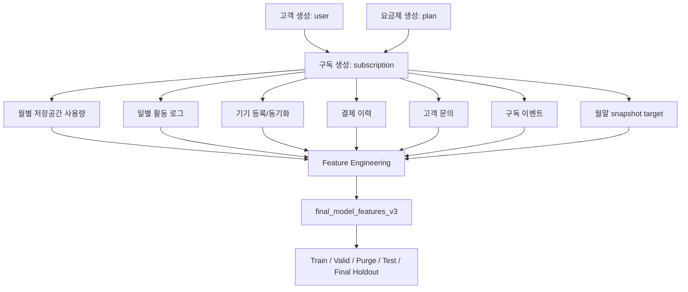
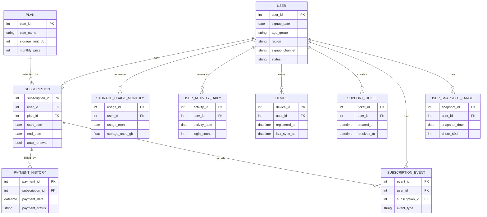
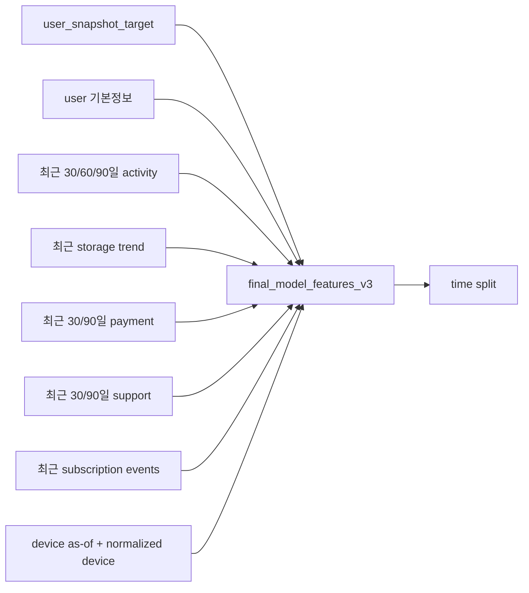

# Cloud Churn 합성 데이터셋 전체 명세서

작성 기준: 현재 프로젝트의 실제 코드, 실제 Excel, report, processed dataset을 확인해 작성했다. 핵심 기준 파일은 `scripts/generate_cloudcare_raw_data.py`, `scripts/generate_cloudcare_raw_data_v2.py`, `scripts/cloudcare_v3_pipeline.py`, `src/snapshot_target.py`, `data/raw/*/generation_report*.json`, `data/processed/v3/*`, `experiments/v3/*`이다.

## 1. 데이터셋을 아주 쉽게 설명

**쉽게 말하면:** 이 데이터셋은 CloudCare라는 가상의 클라우드 저장 서비스에서 "이 고객이 앞으로 60일 안에 이탈할까?"를 연습하기 위해 만든 합성 데이터다. 실제 개인정보나 실제 고객 기록은 없다. 대신 실제 서비스에서 볼 법한 가입, 요금제, 구독, 저장공간 사용량, 로그인 활동, 기기, 결제, 고객문의, 요금제 변경, 이탈 라벨을 코드로 생성했다.

| 항목 | V3 실제 값 |
|---|---:|
| 고객 수 | 5,000 |
| 관측 시작 | 2024-01-01 |
| 관측 종료 | 2026-08-31 |
| 최종 churn 고객 | 810 |
| retained 고객 | 4,190 |
| 전체 churn 비율 | 16.20% |
| snapshot 전체 행 | 68,600 |
| label 판단 가능 행 | 60,371 |
| `churn_60d=1` | 1,526 |
| `churn_60d=0` | 58,845 |
| censored/NULL label | 8,229 |
| known-label positive ratio | 2.53% |

이 프로젝트가 예측하려는 것은 고객의 최종 이탈 여부 자체가 아니라, 특정 월말 snapshot 기준으로 "그 다음 60일 안에 이탈하는지"이다.

예를 들어 고객 A가 2026-01-31에 아직 서비스를 쓰고 있다고 하자. 이때 2026-01-31을 snapshot_date로 잡고, 2026-03-31까지 이탈하면 `churn_60d=1`이다. 2026-03-31까지 계속 유지하면 `churn_60d=0`이다. 그런데 2026-08-31 snapshot은 60일 뒤인 2026-10-30까지 관측 데이터가 없으므로 label을 판단할 수 없다. 이런 경우 `eligible=0`, `churn_60d=NULL`이 된다.

고객 한 명이 여러 snapshot 행을 가지는 이유는 고객 상태가 매달 달라지기 때문이다. 같은 고객도 1월에는 활발히 쓰다가 3월에는 로그인과 저장 사용량이 줄고, 5월에는 결제 실패와 문의가 늘 수 있다. 그래서 "고객 1명 = 학습 행 1개"가 아니라 "고객의 특정 월말 상태 = 학습 행 1개"로 본다.

원천 데이터와 모델 학습용 데이터도 다르다.

| 구분 | 의미 |
|---|---|
| 원천 데이터 5.1~5.10 | 실제 서비스 DB처럼 테이블을 나눈 원본 운영 데이터 |
| `final_model_features_v3` | 원천 테이블을 snapshot 기준으로 안전하게 집계한 모델 입력 데이터 |

## 2. 전체 데이터 흐름

**쉽게 말하면:** 먼저 고객과 상품을 만들고, 그 고객들이 가입하고 사용하고 결제하고 문의하는 과정을 만든 뒤, 월말마다 "앞으로 60일 안에 이탈했는가"를 붙인다. 마지막으로 모델이 볼 수 있는 과거 정보만 모아 feature table을 만든다.

## 3. V3 원천 ERD

관계 설명:

| 관계 | 설명 |
|---|---|
| USER 1:N SUBSCRIPTION | 한 고객은 시간이 지나며 여러 구독 기간을 가질 수 있다. |
| PLAN 1:N SUBSCRIPTION | 하나의 요금제는 여러 고객 구독에서 선택될 수 있다. |
| USER 1:N STORAGE_USAGE_MONTHLY | 한 고객은 매월 저장공간 사용량 기록을 가진다. |
| USER 1:N USER_ACTIVITY_DAILY | 한 고객은 활동이 있었던 날짜마다 활동 로그를 가진다. |
| USER 1:N DEVICE | 한 고객은 여러 기기를 등록할 수 있다. |
| SUBSCRIPTION 1:N PAYMENT_HISTORY | 유료 구독은 결제 이력을 만든다. |
| USER 1:N SUPPORT_TICKET | 한 고객은 여러 문의 티켓을 만들 수 있다. |
| USER/SUBSCRIPTION 1:N SUBSCRIPTION_EVENT | 갱신, 업그레이드, 다운그레이드, 취소 이벤트가 기록된다. |
| USER 1:N USER_SNAPSHOT_TARGET | 한 고객은 여러 월말 snapshot label을 가진다. |

## 4. 5.1~5.10 테이블 기본 정보

### 4.1 `5.1_user`

**쉽게 말하면:** CloudCare 고객 5,000명의 가입 정보와 현재 상태를 담은 고객 마스터 테이블이다.

| 항목 | 내용 |
|---|---|
| 한글 이름 | 사용자 |
| 역할 | 고객 기본 정보 |
| 왜 필요한가 | 모든 행동/구독/기기/문의/target이 고객 기준으로 연결되기 때문 |
| V3 행 수 | 5,000 |
| 한 행 의미 | 고객 1명 |
| 생성 단위 | 고객 |
| 생성 주기 | 1회 |
| PK | `user_id` |
| FK | 없음 |
| 연결 | subscription, storage_usage_monthly, user_activity_daily, device, support_ticket, subscription_event, user_snapshot_target |

| 컬럼명 | 한글 의미 | 타입 | 예시 | NULL 가능 | PK/FK | 생성 기준 | 설명 |
|---|---|---|---|---|---|---|---|
| user_id | 고객 ID | int | 100001 | 불가 | PK | 100001부터 순차 생성 | 모든 고객 단위 테이블의 연결 키 |
| signup_date | 가입일 | date | 2024-10-20 | 불가 |  | 2024-01-01~2026-08-31 범위 | 가입 이후에만 활동/구독이 생성됨 |
| age_group | 연령대 | string | 30대 | V3 불가 |  | 코드의 연령대 분포 | 모델 feature로 사용 가능 |
| region | 지역 | string | 서울 등 | V3 불가 |  | 지역 가중치 분포 | 모델 feature로 사용 가능 |
| signup_channel | 가입 채널 | string | WEB, IOS, ANDROID | 불가 |  | 채널 확률 분포 | 결제 method 생성에도 영향 |
| status | 고객 상태 | string | ACTIVE, INACTIVE | 불가 |  | 활성 구독 여부 기반 | 운영 상태 설명용 |
| created_at | 생성일 | datetime | 가입일 | 불가 |  | 가입일 | 원천 생성 시점 |
| updated_at | 수정일 | datetime | 2026-08-31 | 불가 |  | 관측 종료일 | 관측 종료 기준 |

예시:

| user_id | signup_date | signup_channel | status |
|---:|---|---|---|
| 100001 | 2024-10-20 | ANDROID | ACTIVE |
| 100002 | 2026-06-09 | ANDROID | ACTIVE |
| 100005 | 2025-04-16 | ANDROID | INACTIVE |

첫 행은 100001 고객이 2024-10-20에 Android 채널로 가입했고, 관측 종료일 기준 활성 상태라는 뜻이다.

### 4.2 `5.2_plan`

**쉽게 말하면:** CloudCare에서 판매하는 요금제 목록이다.

| 항목 | 내용 |
|---|---|
| 한글 이름 | 요금제 |
| 역할 | 저장 용량, 월 가격, 과금 주기 정의 |
| V3 행 수 | 7 |
| 한 행 의미 | 요금제 1개 |
| PK | `plan_id` |
| FK | 없음 |
| 연결 | subscription, subscription_event |

| 컬럼명 | 한글 의미 | 타입 | 예시 | NULL 가능 | PK/FK | 생성 기준 | 설명 |
|---|---|---|---|---|---|---|---|
| plan_id | 요금제 ID | int | 1 | 불가 | PK | 고정 1~7 | subscription의 plan_id와 연결 |
| plan_name | 요금제명 | string | 100GB_M | 불가 |  | 고정 목록 | 용량과 과금주기를 이름에 포함 |
| storage_limit_gb | 제공 용량 | int | 100 | 불가 |  | 고정 값 | 사용률 계산의 분모 |
| monthly_price | 월 가격 | int | 2900 | 불가 |  | 고정 값 | payment amount 계산 |
| billing_cycle | 과금 주기 | string | MONTHLY, YEARLY | 불가 |  | 고정 값 | 결제 주기와 renewal 이벤트에 영향 |
| is_paid | 유료 여부 | bool | True | 불가 |  | FREE만 False | 결제 이력 생성 여부 |
| is_active | 판매 중 여부 | bool | True | 불가 |  | 모두 True | 현재 제공 요금제 표시 |

예시:

| plan_id | plan_name | storage_limit_gb | monthly_price | billing_cycle |
|---:|---|---:|---:|---|
| 1 | FREE | 15 | 0 | MONTHLY |
| 2 | 100GB_M | 100 | 2900 | MONTHLY |
| 7 | 2TB_Y | 2000 | 10900 | YEARLY |

`2TB_Y`는 월 가격 기준 10,900원이지만 yearly 요금제이므로 결제 amount는 12개월분으로 계산된다.

### 4.3 `5.3_subscription`

**쉽게 말하면:** 고객이 어떤 기간에 어떤 요금제를 사용했는지 나타내는 구독 이력 테이블이다.

| 항목 | 내용 |
|---|---|
| 한글 이름 | 구독 |
| 역할 | 고객-요금제-기간 연결 |
| V3 행 수 | 5,462 |
| 한 행 의미 | 고객의 하나의 구독 기간 |
| 생성 단위 | 구독 구간 |
| 생성 주기 | 가입, 플랜 변경, 종료 시 |
| PK | `subscription_id` |
| FK | `user_id`, `plan_id` |
| 연결 | user, plan, payment_history, subscription_event |

| 컬럼명 | 한글 의미 | 타입 | 예시 | NULL 가능 | PK/FK | 생성 기준 | 설명 |
|---|---|---|---|---|---|---|---|
| subscription_id | 구독 ID | int | 1 | 불가 | PK | 순차 생성 | 결제/이벤트 연결 키 |
| user_id | 고객 ID | int | 100001 | 불가 | FK | user에서 참조 | 어떤 고객의 구독인지 |
| plan_id | 요금제 ID | int | 3 | 불가 | FK | plan에서 참조 | 사용 요금제 |
| start_date | 시작일 | date | 2024-10-20 | 불가 |  | 가입/변경일 | snapshot 기준 활성 여부 판단 |
| next_billing_date | 다음 결제 예정일 | date | 2026-10-20 | 가능 |  | 활성 유료 구독일 때 계산 | `days_to_renewal` feature 원천 |
| end_date | 종료일 | date | NULL | 가능 |  | 이탈/변경/만료 시 기록 | NULL이면 현재 활성 구독 |
| auto_renewal | 자동갱신 여부 | bool | True | 불가 |  | 위험/가격민감도 반영 | auto_renewal_off_flag 원천 |
| subscription_status | 구독 상태 | string | ACTIVE, EXPIRED, CANCELLED | 불가 |  | 종료 여부 기반 | 현재 구독 상태 |
| created_at | 생성 시각 | datetime | start_date | 불가 |  | 구독 시작일 | 원천 기록 시각 |
| updated_at | 수정 시각 | datetime | end_date 또는 관측 종료일 | 불가 |  | 상태 갱신일 | 운영 기록 |

예시:

| subscription_id | user_id | plan_id | start_date | next_billing_date | end_date | status |
|---:|---:|---:|---|---|---|---|
| 1 | 100001 | 3 | 2024-10-20 | 2026-10-20 | NULL | ACTIVE |
| 2 | 100002 | 7 | 2026-06-09 | NULL | 2026-08-25 | EXPIRED |
| 3 | 100002 | 6 | 2026-08-26 | 2026-09-26 | NULL | ACTIVE |

100002 고객은 2TB yearly 구독이 만료된 뒤 2TB monthly로 다시 시작한 예시다.

### 4.4 `5.4_storage_usage_monthly`

**쉽게 말하면:** 고객이 매월 저장공간을 얼마나 쓰는지 기록한 월별 사용량 테이블이다.

| 항목 | 내용 |
|---|---|
| 한글 이름 | 월별 저장공간 사용량 |
| 역할 | usage/저장량 감소 trend를 만들기 위한 원천 |
| V3 행 수 | 69,377 |
| 한 행 의미 | 고객 1명의 특정 월 사용량 |
| 생성 단위 | 고객-월 |
| 생성 주기 | 월 1회 |
| PK | `usage_id` |
| FK | `user_id` |

| 컬럼명 | 한글 의미 | 타입 | 예시 | NULL 가능 | PK/FK | 생성 기준 | 설명 |
|---|---|---|---|---|---|---|---|
| usage_id | 사용량 ID | int | 1 | 불가 | PK | 순차 생성 | 행 식별자 |
| user_id | 고객 ID | int | 100001 | 불가 | FK | user 참조 | 고객 연결 |
| usage_month | 사용 월 | date | 2024-10-01 | 불가 |  | 월 첫날 | 어떤 월의 사용량인지 |
| storage_used_gb | 사용 저장공간 | float | 14.12 | 불가 |  | 요금제 한도와 위험 상태 반영 | 감소 trend feature 원천 |
| file_count | 파일 수 | int | 2350 | 불가 |  | 저장량 기반 | 사용 규모 |
| photo_count | 사진 수 | int | 1351 | 불가 |  | 파일 수 일부 | 콘텐츠 구성 |
| video_count | 영상 수 | int | 127 | 불가 |  | 파일 수 일부 | 콘텐츠 구성 |
| upload_size_gb | 업로드 용량 | float | 2.17 | 불가 |  | engagement와 warning 반영 | 활동성 지표 |
| download_size_gb | 다운로드 용량 | float | 2.13 | 불가 |  | engagement와 random noise | 사용성 지표 |
| created_at | 기록 생성 시각 | datetime | 월말 23시 | 불가 |  | 월말 | snapshot 이전 가용성 판단 |

예시:

| usage_id | user_id | usage_month | storage_used_gb | file_count |
|---:|---:|---|---:|---:|
| 1 | 100001 | 2024-10-01 | 14.12 | 2350 |
| 2 | 100001 | 2024-11-01 | 7.97 | 1479 |
| 3 | 100001 | 2024-12-01 | 4.96 | 1255 |

100001 고객은 예시상 저장공간 사용량이 14.12GB에서 7.97GB, 4.96GB로 줄어든다. 이런 변화가 `storage_change_rate_1m`, `storage_slope_90d` 같은 feature가 된다.

### 4.5 `5.5_user_activity_daily`

**쉽게 말하면:** 고객이 서비스를 사용한 날짜의 로그인, 업로드, 다운로드, 미리보기 같은 활동 로그다.

| 항목 | 내용 |
|---|---|
| 한글 이름 | 일별 사용자 활동 |
| 역할 | 최근 활동량과 활동 감소 trend 계산 |
| V3 행 수 | 181,956 |
| 한 행 의미 | 고객 1명의 특정 날짜 활동 |
| 생성 단위 | 고객-일 |
| 생성 주기 | 활동이 발생한 날 |
| PK | `activity_id` |
| FK | `user_id` |

| 컬럼명 | 한글 의미 | 타입 | 예시 | NULL 가능 | PK/FK | 생성 기준 | 설명 |
|---|---|---|---|---|---|---|---|
| activity_id | 활동 ID | int | 1 | 불가 | PK | 순차 생성 | 행 식별자 |
| user_id | 고객 ID | int | 100001 | 불가 | FK | user 참조 | 고객 연결 |
| activity_date | 활동일 | date | 2024-11-06 | 불가 |  | 가입 이후, 이탈 전 | snapshot 다음 날부터 가용 처리 |
| login_count | 로그인 수 | int | 1 | 불가 |  | engagement/risk 반영 | 핵심 activity feature |
| upload_count | 업로드 수 | int | 4 | 불가 |  | activity intensity 반영 | action_count 구성 |
| download_count | 다운로드 수 | int | 2 | 불가 |  | activity intensity 반영 | action_count 구성 |
| share_count | 공유 수 | int | 1 | 불가 |  | activity intensity 반영 | action_count 구성 |
| preview_count | 미리보기 수 | int | 2 | 불가 |  | activity intensity 반영 | action_count 구성 |
| active_minutes | 활동 시간 | int | 25 | 불가 |  | activity intensity 반영 | 체류/사용 시간 |

예시:

| activity_id | user_id | activity_date | login_count | active_minutes |
|---:|---:|---|---:|---:|
| 1 | 100001 | 2024-11-06 | 1 | 25 |
| 2 | 100001 | 2024-11-08 | 3 | 24 |
| 5 | 100001 | 2025-02-25 | 3 | 36 |

이 테이블은 "최근 30일 로그인 수", "전 30일 로그인 수", "90일 로그인 slope" 등을 만드는 핵심 원천이다.

### 4.6 `5.6_device`

**쉽게 말하면:** 고객이 등록한 모바일, PC, 태블릿 기기와 동기화 상태를 담은 테이블이다.

| 항목 | 내용 |
|---|---|
| 한글 이름 | 기기 |
| 역할 | 고객 사용 환경과 동기화 friction 표현 |
| V3 행 수 | 16,197 |
| 한 행 의미 | 등록 기기 1대 |
| PK | `device_id` |
| FK | `user_id` |

| 컬럼명 | 한글 의미 | 타입 | 예시 | NULL 가능 | PK/FK | 생성 기준 | 설명 |
|---|---|---|---|---|---|---|---|
| device_id | 기기 ID | int | 1 | 불가 | PK | 순차 생성 | 행 식별자 |
| user_id | 고객 ID | int | 100001 | 불가 | FK | user 참조 | 고객 연결 |
| device_type | 기기 유형 | string | MOBILE, PC, TABLET | 불가 |  | 확률 분포 | device_type_count 계산 |
| os_type | OS | string | IOS, ANDROID, WINDOWS, MACOS | 불가 |  | 기기 유형에 따라 | os_type_count 계산 |
| sync_enabled | 동기화 활성화 | bool | True | 불가 |  | technical friction 반영 | 사용 문제 가능성 |
| last_sync_at | 마지막 동기화 | datetime | 2026-08-17 | 가능 |  | friction/비활성 반영 | NULL은 동기화 기록 없음 |
| registered_at | 등록일 | datetime | 2025-05-19 | 불가 |  | 가입 이후 | snapshot 이전 등록 기기만 사용 |

예시:

| device_id | user_id | device_type | os_type | sync_enabled | last_sync_at |
|---:|---:|---|---|---|---|
| 1 | 100001 | TABLET | IOS | True | 2026-06-08 |
| 2 | 100001 | PC | WINDOWS | True | 2026-08-17 |
| 3 | 100001 | MOBILE | IOS | False | NULL |

V2에서 `device_count_asof`가 시간 누적 효과를 만들 수 있었기 때문에 V3 feature에는 `devices_per_account_year`, `device_count_per_tenure`, `device_count_per_sqrt_age` 같은 정규화 feature도 포함했다.

### 4.7 `5.7_payment_history`

**쉽게 말하면:** 유료 구독의 결제 성공/실패/재시도/연체 이벤트를 담은 결제 이력이다.

| 항목 | 내용 |
|---|---|
| 한글 이름 | 결제 이력 |
| 역할 | financial risk와 결제 friction 표현 |
| V3 행 수 | 34,318 |
| 한 행 의미 | 결제 1건 |
| PK | `payment_id` |
| FK | `subscription_id` |

| 컬럼명 | 한글 의미 | 타입 | 예시 | NULL 가능 | PK/FK | 생성 기준 | 설명 |
|---|---|---|---|---|---|---|---|
| payment_id | 결제 ID | int | 1 | 불가 | PK | 순차 생성 | 행 식별자 |
| subscription_id | 구독 ID | int | 1 | 불가 | FK | subscription 참조 | 어떤 구독의 결제인지 |
| payment_date | 결제 예정/발생일 | datetime | 2024-10-20 12:00 | 불가 |  | billing_cycle 기준 | 결제 이벤트 시점 |
| amount | 금액 | int | 32400 | 불가 |  | 요금제 가격×주기 | 이상치/금액 검증 가능 |
| payment_status | 결제 상태 | string | SUCCESS, FAILED, REFUNDED | 불가 |  | financial risk/warning 반영 | 실패 feature 원천 |
| payment_method | 결제 수단 | string | CARD, PLAY_STORE, APP_STORE | 불가 |  | 가입 채널 기반 | 결제 채널 |
| retry_count | 재시도 수 | int | 0 | 불가 |  | 실패/위험도 반영 | `retry_count_90d` 원천 |
| overdue_flag | 연체 여부 | int | 0/1 | 불가 |  | 실패와 financial risk 반영 | `overdue_count_90d` 원천 |
| status_changed_at | 상태 변경 시각 | datetime | 2024-10-21 09:00 | 불가 |  | payment_date 이후 | point-in-time feature 기준 |

예시:

| payment_id | subscription_id | payment_date | amount | payment_status | retry_count |
|---:|---:|---|---:|---|---:|
| 1 | 1 | 2024-10-20 12:00 | 32400 | SUCCESS | 0 |
| 3 | 2 | 2026-06-09 12:00 | 130800 | SUCCESS | 0 |
| 4 | 3 | 2026-08-26 12:00 | 11900 | SUCCESS | 0 |

V3에서는 `status_changed_at`을 추가해 "snapshot 이전에 알 수 있었던 결제 실패만 feature로 사용"할 수 있게 했다.

### 4.8 `5.8_support_ticket`

**쉽게 말하면:** 고객이 결제, 동기화, 저장공간, 오류 문제로 문의한 기록이다.

| 항목 | 내용 |
|---|---|
| 한글 이름 | 고객 문의 |
| 역할 | technical friction과 dissatisfaction 표현 |
| V3 행 수 | 15,246 |
| 한 행 의미 | 문의 티켓 1건 |
| PK | `ticket_id` |
| FK | `user_id` |

| 컬럼명 | 한글 의미 | 타입 | 예시 | NULL 가능 | PK/FK | 생성 기준 | 설명 |
|---|---|---|---|---|---|---|---|
| ticket_id | 티켓 ID | int | 1 | 불가 | PK | 순차 생성 | 행 식별자 |
| user_id | 고객 ID | int | 100001 | 불가 | FK | user 참조 | 문의 고객 |
| category | 문의 유형 | string | 결제/동기화/저장공간/오류 | 불가 |  | financial/technical/storage 상태 반영 | 문제 종류 |
| priority | 우선순위 | string | LOW, NORMAL, HIGH, URGENT | 불가 |  | severity 반영 | urgent_ticket_share 원천 |
| status | 처리 상태 | string | RESOLVED, OPEN | 불가 |  | resolved_at 여부 | 미해결 feature 원천 |
| created_at | 문의 생성 시각 | datetime | 2025-06-08 05:00 | 불가 |  | 위험/마찰 증가 시 빈도 증가 | point-in-time 기준 |
| resolved_at | 해결 시각 | datetime | 2025-06-17 02:44 | 가능 |  | 해결된 경우 | snapshot 이후 해결은 미래정보라 제외 |
| reopened | 재오픈 여부 | bool | True | 불가 |  | friction/warning 반영 | reopened_count_90d 원천 |

예시:

| ticket_id | user_id | priority | status | created_at | reopened |
|---:|---:|---|---|---|---|
| 1 | 100001 | HIGH | RESOLVED | 2025-06-08 05:00 | True |
| 2 | 100001 | NORMAL | RESOLVED | 2025-12-15 07:00 | False |
| 4 | 100001 | NORMAL | RESOLVED | 2026-05-29 16:00 | True |

문의가 늘고, HIGH/URGENT 비중이 올라가고, 해결 시간이 길어지면 고객 마찰이 커졌다는 신호가 된다.

### 4.9 `5.9_subscription_event`

**쉽게 말하면:** 구독 갱신, 업그레이드, 다운그레이드, 취소 같은 구독 이벤트 기록이다.

| 항목 | 내용 |
|---|---|
| 한글 이름 | 구독 이벤트 |
| 역할 | plan change, downgrade, renewal timing 표현 |
| V3 행 수 | 10,941 |
| 한 행 의미 | 구독 관련 이벤트 1건 |
| PK | `event_id` |
| FK | `user_id`, `subscription_id`, `old_plan_id`, `new_plan_id` |

| 컬럼명 | 한글 의미 | 타입 | 예시 | NULL 가능 | PK/FK | 생성 기준 | 설명 |
|---|---|---|---|---|---|---|---|
| event_id | 이벤트 ID | int | 1 | 불가 | PK | 순차 생성 | 행 식별자 |
| user_id | 고객 ID | int | 100001 | 불가 | FK | user 참조 | 이벤트 고객 |
| subscription_id | 구독 ID | int | 1 | 불가 | FK | subscription 참조 | 이벤트 구독 |
| event_type | 이벤트 유형 | string | RENEW, UPGRADE, DOWNGRADE, CANCEL | 불가 |  | 구독 변화에서 생성 | feature 원천 |
| old_plan_id | 이전 요금제 | int | 3 | 불가 | FK | plan 참조 | 변경 전 |
| new_plan_id | 이후 요금제 | int/NULL | 3 | CANCEL은 NULL 가능 | FK | plan 참조 | 변경 후 |
| event_date | 이벤트 일자 | date | 2025-10-20 | 불가 |  | 갱신/변경/취소일 | snapshot 이전만 사용 |
| auto_renewal_after | 이벤트 후 자동갱신 | bool | True | 불가 |  | V3 추가 | 갱신 선호 변화 |

예시:

| event_id | user_id | event_type | old_plan_id | new_plan_id | event_date |
|---:|---:|---|---:|---:|---|
| 1 | 100001 | RENEW | 3 | 3 | 2025-10-20 |
| 2 | 100002 | DOWNGRADE | 7 | 6 | 2026-08-26 |
| 3 | 100003 | RENEW | 5 | 5 | 2026-01-16 |

다운그레이드는 가격 민감도나 사용량 감소와 연결될 수 있고, renewal approaching은 이탈 hazard와 상호작용할 수 있다.

### 4.10 `5.10_user_snapshot_target`

**쉽게 말하면:** 모델이 맞혀야 하는 정답 테이블이다. 특정 월말에 아직 서비스를 쓰는 고객이 앞으로 60일 안에 이탈했는지를 기록한다.

| 항목 | 내용 |
|---|---|
| 한글 이름 | 사용자 snapshot target |
| 역할 | D-60 churn label |
| V3 행 수 | 68,600 |
| 한 행 의미 | 고객 1명의 특정 월말 예측 사례 |
| 생성 단위 | 고객-월말 snapshot |
| 생성 주기 | 월말 |
| PK | `snapshot_id` |
| FK | `user_id` |

| 컬럼명 | 한글 의미 | 타입 | 예시 | NULL 가능 | PK/FK | 생성 기준 | 설명 |
|---|---|---|---|---|---|---|---|
| snapshot_id | snapshot ID | int | 1 | 불가 | PK | 순차 생성 | 학습 행 식별자 |
| user_id | 고객 ID | int | 100011 | 불가 | FK | user 참조 | 예측 대상 고객 |
| snapshot_date | 기준일 | date | 2024-01-31 | 불가 |  | 월말 | 이 날짜 이전 정보만 feature로 사용 |
| label_window_end | label 종료일 | date | 2024-03-31 | 불가 |  | snapshot+60일 | 모델 입력 금지 |
| churn_date | 최종 이탈일 | date | 2024-03-25 | 가능 |  | 구독 종료 이력에서 계산 | 모델 입력 금지 |
| churn_60d | 60일 내 이탈 여부 | int/NULL | 1 | 가능 | target | window 내 이탈 여부 | 예측 target |
| active_subscription_count | 기준일 활성 구독 수 | int | 1 | 불가 |  | snapshot 기준 | target 생성 검산용 |
| eligible | label 판단 가능 여부 | int | 1 | 불가 |  | 60일 뒤까지 관측 가능하면 1 | 0이면 churn_60d NULL |
| created_at | 생성일 | datetime | 2026-09-26 | 불가 |  | V3 생성 시각 | 산출물 기록 |

예시:

| snapshot_id | user_id | snapshot_date | label_window_end | churn_date | churn_60d | eligible |
|---:|---:|---|---|---|---:|---:|
| 1 | 100011 | 2024-01-31 | 2024-03-31 | 2024-03-25 | 1 | 1 |
| 2 | 100058 | 2024-01-31 | 2024-03-31 | NULL | 0 | 1 |
| 3 | 100060 | 2024-01-31 | 2024-03-31 | 2024-04-24 | 0 | 1 |

첫 행은 2024-01-31 기준으로 2024-03-31 안에 이탈했으므로 positive다. 세 번째 행은 이탈일이 2024-04-24라서 최종적으로는 이탈 고객이지만 해당 snapshot의 60일 window 안에는 이탈하지 않았으므로 `churn_60d=0`이다.

## 5. 합성 데이터 생성 기준

**쉽게 말하면:** 실제 서비스 고객은 모두 같은 행동을 하지 않는다. 어떤 고객은 원래 활동적이고, 어떤 고객은 가격에 민감하고, 어떤 고객은 기술 문제를 자주 겪는다. V3는 이런 보이지 않는 성향을 먼저 만들고, 그 성향이 사용량/활동/결제/문의/구독 이벤트에 간접적으로 나타나도록 만들었다.

| 영역 | V3 생성 기준 |
|---|---|
| 고객 가입 시점 | 2024-01-01~2026-08-31 사이, Beta 분포로 생성 |
| 요금제 | FREE, 100GB/200GB/2TB, 월간/연간 7개 고정 |
| 구독 | 가입 후 요금제 선택, 위험과 가격민감도에 따라 변경/다운그레이드 가능 |
| storage | 요금제 한도, engagement, warning, persona, random noise 반영 |
| activity | engagement가 높으면 활동 증가, warning이 높으면 활동 확률/강도 감소 |
| device | 고객 규모, engagement, 유료 여부, technical friction 반영 |
| payment | financial risk와 warning이 높으면 실패/재시도/연체 증가 |
| support | technical friction, 낮은 satisfaction, warning이 높으면 문의 증가 |
| subscription_event | renewal, downgrade, cancel 등 구독 변화 기록 |
| churn | sustained risk, observable warning, competitor intent, future shock를 hazard에 반영 |

V3에서 중요한 점은 churn_date를 먼저 정한 뒤 과거 행동을 조작하지 않았다는 것이다. 먼저 고객의 지속 위험 상태와 성향을 만들고, 같은 위험 상태가 행동에도 영향을 주고 미래 이탈 hazard에도 영향을 주게 했다.

## 6. V3 Hidden Factor

**쉽게 말하면:** hidden factor는 "데이터 생성기가 알고 있는 고객 속마음"이다. 현실에서 고객 만족도를 정확히 0.83처럼 알 수 없으므로 모델 feature에는 넣지 않았다. 대신 그 속마음이 로그인 감소, 문의 증가, 결제 실패 같은 관측 가능한 행동으로 일부 드러나게 했다.

| hidden factor | 의미 | 높으면 나타날 수 있는 행동 | 영향 테이블 | churn 영향 |
|---|---|---|---|---|
| engagement | 서비스에 적극적인 정도 | 로그인/업로드/다운로드 증가, device 증가 | activity, storage, device | 낮을수록 위험 증가 |
| satisfaction | 만족도 | 낮으면 warning 증가, 문의 증가 | support, activity | 낮을수록 위험 증가 |
| financial_risk | 결제 불안정성 | 결제 실패, 재시도, 연체 증가 | payment_history, support category | 높을수록 위험 증가 |
| technical_friction | 기술적 마찰 | 동기화 문제, 문의, 재오픈, 해결 지연 | device, support_ticket | 높을수록 위험 증가 |
| price_sensitivity | 가격 민감도 | 다운그레이드, auto renewal off 가능성 | subscription, subscription_event | 높을수록 위험 증가 |
| competitor_intent | 경쟁 서비스 이동 의향 | 직접 관측은 약함 | 주로 churn hazard | 높을수록 위험 증가 |
| personas | 이탈 신호 유형 가중치 | engagement/technical/financial/price/silent 패턴 혼합 | 여러 테이블 | 유형별 행동 차이 |
| silent | 조용한 이탈 여부 | observable warning 약함 | 관측 신호 약화 | hidden churn 가능 |
| size_factor | 고객 규모 | device 수 증가 | device | 직접 target 아님 |

hidden factor를 모델에 직접 넣지 않은 이유는 leakage와 현실성 때문이다. 현실에서는 "고객의 competitor intent=0.71" 같은 값을 정확히 알 수 없다. 모델은 실제 운영 데이터처럼 로그와 이벤트에서 드러난 흔적만 보고 예측해야 한다.

## 7. V3 Risk State 구조

**쉽게 말하면:** V3는 LOW/HIGH 같은 이름의 상태 컬럼을 파일에 저장하지 않는다. 대신 코드 내부에서 매일 변하는 `risk`, 최근 30일 평균 `risk30`, 최근 90일 평균 `risk90`, 높은 위험이 지속된 기간, 그리고 이를 합친 `sustained`를 만든다.

실제 구현:

| 내부 값 | 의미 |
|---|---|
| `risk` | 그날의 즉시 위험 정도 |
| `risk30` | 최근 30일 위험 평균 |
| `risk90` | 최근 90일 위험 평균 |
| `high_duration` | risk가 0.62를 넘은 상태가 얼마나 지속됐는지 |
| `sustained` | risk, risk30, risk90, duration을 합친 지속 위험 |
| `warning` | sustained risk와 낮은 satisfaction에서 나온 observable warning 가능성 |

V3 frozen config:

| 파라미터 | 값 | 쉬운 의미 |
|---|---:|---|
| risk_persistence | 0.94 | 위험 상태가 하루 만에 사라지지 않고 오래 지속됨 |
| future_shock_weight | 0.30 | 미래 랜덤 충격은 남기되 영향 제한 |
| behavior_signal_strength | 1.10 | 위험이 행동 악화로 전달되는 강도 |
| churn_sustained_risk_weight | 1.65 | 지속 위험이 churn hazard에 주는 영향 |
| churn_observable_warning_weight | 0.65 | 관측 warning이 churn hazard에 주는 영향 |
| target_overall_churn_ratio | 0.162 | 전체 고객 기준 약 16.2% churn 목표 |

예시 흐름:

1. 1월: 고객이 정상적으로 로그인하고 저장공간을 사용한다.
2. 2월: 내부 risk가 상승하기 시작한다.
3. 3월: risk30/risk90도 올라가면서 sustained risk가 커진다.
4. 4월: 로그인 수와 active_minutes가 줄고, storage 증가세가 둔화된다.
5. 5월: 결제 실패나 문의가 일부 발생한다.
6. 이후 60일 안 churn hazard가 높아진다.

이 과정은 churn_date를 보고 과거 행동을 끼워 넣은 것이 아니다. 같은 원인인 sustained risk가 행동과 미래 churn에 동시에 영향을 준다.

## 8. 고객별 churn 유형/persona

V3 코드에는 `persona_w = rng.dirichlet([2.2, 1.6, 1.3, 1.2, 1.1])`로 5개 persona 가중치가 섞인다. 이름이 컬럼으로 저장되지는 않지만, 코드상 각 index가 특정 행동 경로에 쓰인다.

| 유형 | 코드상 연결 | 주로 나타나는 행동 | 확인 테이블 |
|---|---|---|---|
| Engagement형 | `personas[0]` | 활동 확률/강도 감소, 저장 사용 둔화 | user_activity_daily, storage_usage_monthly |
| Technical형 | `personas[1]` 및 technical_friction | 문의 증가, priority 상승, reopen 증가, sync 지연 | support_ticket, device |
| Financial형 | `personas[2]` 및 financial_risk | 결제 실패, retry, overdue 증가 | payment_history |
| Price-sensitive형 | `personas[3]` 및 price_sensitivity | 저장 사용 둔화, downgrade, auto renewal off | subscription, subscription_event |
| Silent형 | `silent=True` | warning이 약하지만 churn 가능 | 관측 신호 약함, target에서 확인 |

한 고객은 하나의 유형으로 고정되지 않는다. 여러 persona 가중치가 섞여서 "가격에도 민감하고 기술 문제도 있는 고객"처럼 만들 수 있다.

## 9. Noise, 결측, 중복, 이상치

**쉽게 말하면:** 현실 데이터는 완벽하지 않다. V1/V2는 결측, 누락 로그, 중복, 이상치를 명시적으로 주입했다. V3는 V1/V2식 결측/이상치 주입보다는 point-in-time event timing과 행동 랜덤성을 강화했고, 정상 NULL과 payload duplicate가 일부 존재한다.

### V3 report 기준 NULL/중복

| 테이블 | rows | PK duplicate | payload duplicate | 주요 NULL |
|---|---:|---:|---:|---|
| user | 5,000 | 0 | 73 | 없음 |
| plan | 7 | 0 | 0 | 없음 |
| subscription | 5,462 | 0 | 0 | next_billing_date 2,385, end_date 4,170 |
| storage_usage_monthly | 69,377 | 0 | 0 | 없음 |
| user_activity_daily | 181,956 | 0 | 0 | 없음 |
| device | 16,197 | 0 | 13 | last_sync_at 971 |
| payment_history | 34,318 | 0 | 0 | 없음 |
| support_ticket | 15,246 | 0 | 0 | resolved_at 920 |
| subscription_event | 10,941 | 0 | 0 | new_plan_id 637 |
| user_snapshot_target | 68,600 | 0 | 0 | churn_date 65,218, churn_60d 8,229 |

### 정상 NULL과 오류 NULL 구분

| NULL 위치 | 의미 | 정상 여부 | 처리 |
|---|---|---|---|
| subscription.end_date | 아직 활성 구독 | 정상 | 삭제하면 안 됨 |
| subscription.next_billing_date | 무료/종료/일부 구독에서 다음 결제 없음 | 정상 | feature 계산 시 주의 |
| device.last_sync_at | 동기화 기록 없음 또는 비활성 | 정상 신호 | missing 자체가 의미 있음 |
| support_ticket.resolved_at | 아직 미해결 | 정상 신호 | unresolved feature로 활용 |
| subscription_event.new_plan_id | CANCEL이면 이후 plan 없음 | 정상 | 이벤트 유형과 함께 해석 |
| user_snapshot_target.churn_date | 아직 최종 이탈하지 않음 | 정상 | 모델 입력 금지 |
| user_snapshot_target.churn_60d | 60일 뒤까지 관측 불가 | 정상 censored | 학습에서 제외 |

### 중복 개념

| 개념 | 설명 | V3 |
|---|---|---|
| PK duplicate | ID가 같은 행이 2개 이상 | 모든 테이블 0 |
| payload duplicate | ID를 제외한 값이 같은 행 | user 73, device 13 |
| logical duplicate | 같은 고객/날짜 등 업무상 같은 사건 중복 | V3 report에는 별도 주입량 없음 |

payload duplicate는 무조건 삭제하면 안 된다. 예를 들어 두 기기가 같은 유형과 같은 등록일을 가질 수도 있고, 고객 기본정보 일부가 우연히 같을 수도 있다. EDA에서는 "ID까지 같은지", "업무키가 같은지", "값 충돌이 있는지"를 나눠 확인해야 한다.

### 이상치와 랜덤성

V3 코드에는 V1/V2처럼 별도 `inject_outliers` 함수는 없다. 대신 생성 자체에 다음 랜덤성이 들어간다.

| noise | 왜 넣었나 | 테이블 | 처리 |
|---|---|---|---|
| 사용량 랜덤 성장/감소 | 모든 고객이 매끈하게 감소하면 비현실적 | storage_usage_monthly | trend와 단기 변동 분리 |
| 일별 활동 Bernoulli/Poisson/Gamma | 활동일과 활동량은 원래 불규칙 | user_activity_daily | 30/60/90일 집계 사용 |
| 결제 실패/환불/재시도 | 결제 시스템과 고객 상황의 불확실성 | payment_history | status_changed_at 기준 point-in-time 집계 |
| 문의 발생/해결 지연/reopen | 고객지원 로그의 변동성 | support_ticket | snapshot 이전 생성/해결만 사용 |
| silent churn | 신호 없이 이탈하는 고객 보존 | target과 hidden process | 모델 성능이 완벽해지지 않게 함 |
| false warning | 위험해 보여도 유지하는 고객 | 전체 행동 테이블 | precision/recall trade-off 필요 |
| recovery | 일시 악화 후 회복 가능 | risk process와 행동 로그 | 최근 trend와 이전 trend 비교 필요 |

## 10. V1 → V2 → V3 변화 과정

**쉽게 말하면:** V1은 첫 번째 합성 데이터다. V2는 V1에서 observable churn signal이 약한 문제를 보완했다. V3는 V2에서도 미래 60일 churn 예측 가능성과 시간 안정성이 부족한 문제를 보완했다.

| 항목 | V1 | V2 | V3 | 변경 이유 |
|---|---|---|---|---|
| 고객 수 | 5,000 | 5,000 | 5,000 | 비교 가능성 유지 |
| 최종 churn | 815 | 826 | 810 | 약 16% 유지 |
| 전체 churn ratio | 16.30% | 16.52% | 16.20% | prevalence를 억지로 올리지 않음 |
| snapshot positive | 2.34% | 2.42% | 2.53% | 60일 label 구조 유지 |
| hidden factor | engagement, satisfaction 등 | 유지, response 강화 | hidden factor+persona+silent+size | 고객별 행동 유형 다양화 |
| risk persistence | AR 0.65 | AR 0.85 | persistence 0.94 + 30/90일 risk | 지속 위험 반영 강화 |
| future shock | 상대적으로 큼 | 일부 완화 | weight 0.30 | 미래 랜덤성 축소 |
| activity | pressure 반영 약함 | 계수 강화 | warning/persona 기반 trend | 최근 30/90일 feature가 의미 있게 |
| usage | decline 약함 | decline 강화 | sustained warning 기반 점진 악화 | storage trend 강화 |
| payment | 실패 시점 불충분 | 실패/재시도 강화 | status_changed_at, overdue 추가 | point-in-time feature 가능 |
| support | count 중심 | priority/reopen 강화 | 해결시간/재오픈/urgent 시점 안전 | support friction feature 가능 |
| subscription | plan change/downgrade | 위험 반응 강화 | renewal, auto_renewal_after, downgrade | renewal risk 표현 |
| device | account age drift 가능 | 거의 유지 | 규모/plan/engagement 기반 + 정규화 feature | temporal drift 완화 |
| model feature | V1/V2 29개 중심 | 29개 baseline | 52개 V3 feature | 원천 신호 활용 확대 |
| split | 시간순+purge | 시간순+purge | train/valid/purge/test/final holdout | final holdout 추가 |

### V1의 확인된 한계

V1 report의 behavior 진단에서 churn/retained 차이가 일부 약했다. 예를 들어 V1에서 failed_payment는 churn 9.24%, retained 10.56%로 방향이 기대와 다르게 나타났다. login declining도 churn 50.15%, retained 48.39%로 차이가 작았다. 이는 hidden factor가 있더라도 모델이 관측 가능한 행동에서 충분히 읽기 어려웠다는 뜻이다.

### V1 → V2 주요 변경

V2 문서와 diff 기준 주요 변경:

| 항목 | V1 | V2 | 이유 |
|---|---:|---:|---|
| response=0 비율 | 18% | 7% | hidden risk가 행동으로 전달되는 비율 증가 |
| response Beta | Beta(2,2) | Beta(3,2) | 반응 평균 강화 |
| 고객별 잡음 SD | 0.40 | 0.30 | 독립 잡음 완화 |
| 월 innovation SD | 0.90 | 0.70 | 단기 변동 완화 |
| AR 계수 | 0.65 | 0.85 | 위험 지속성 강화 |
| storage decline 계수 | 0.25 | 0.42 | usage 감소 신호 강화 |
| activity pressure 계수 | 0.8 | 1.1 | 활동 감소 신호 강화 |
| payment pressure 계수 | 0.16 | 0.28 | 결제 실패 신호 강화 |
| support 생성 | lifetime 가중 추출 | 월별 forward Poisson | 시점별 위험 반영 |

### V2의 확인된 한계

V2 결과는 V1보다 observable signal이 좋아졌지만, baseline 결과에서 Valid 대비 Test 성능 하락이 확인됐다. 사용자 요청에 기록된 기준으로 CatBoost Valid ROC-AUC는 약 0.715, Test ROC-AUC는 약 0.659, Valid PR-AUC는 약 0.111, Test PR-AUC는 약 0.048 수준이었다. 또한 V2 문서에 따르면 강화한 payment/retry/reopen 중 일부는 상태 변경 시각이 없어 baseline feature에서 직접 쓰기 어려웠다. `device_count_asof` 같은 시간 누적 feature는 account age와 섞여 가짜 관계를 만들 수 있었다.

### V2 → V3 주요 변경

| V3 변경 | 실제 구현 | 이유 |
|---|---|---|
| sustained risk | risk + risk30 + risk90 + high_duration | 최근 60~120일 위험이 미래 churn과 연결되게 |
| risk persistence | 0.94 | 단기 spike보다 지속 위험 강화 |
| warning | sustained risk와 낮은 satisfaction에서 생성 | 행동 악화로 전달 |
| future shock 축소 | `future_shock_weight=0.30` | 과거 행동으로 예측 가능한 부분 확대 |
| personas | Dirichlet 5개 가중치 | churn 유형 다양화 |
| silent churn | 14% silent, warning 감소 | observable 신호 없는 이탈 유지 |
| payment timing | `status_changed_at`, `overdue_flag` 추가 | 결제 feature를 시점 안전하게 |
| support timing | created/resolved/reopened 기반 90일 feature | 문의 악화 패턴 반영 |
| renewal timing | `days_to_renewal`, auto renewal | renewal approaching risk 표현 |
| device drift | size/plan/engagement 기반 device, 정규화 feature | account age drift 완화 |
| final holdout | 2026-06-30 | 개발 후 단 한 번 평가용 |

## 11. V3 Pilot → Calibration → Freeze

**쉽게 말하면:** V3는 바로 공식 데이터를 만든 것이 아니라, pilot으로 "신호가 실제로 학습 가능한지" 먼저 확인하고 generator를 freeze했다.

실제 실행상 pilot은 seed 42, 123, 2026으로 확인되었다.

| seed | churn ratio | Valid ROC-AUC | Valid PR-AUC | strong signal count | median abs effect |
|---:|---:|---:|---:|---:|---:|
| 42 | 16.13% | 0.9735 | 0.5949 | 16 | 0.1760 |
| 123 | 16.27% | 0.9513 | 0.4006 | 19 | 0.1579 |
| 2026 | 16.13% | 0.9592 | 0.4429 | 14 | 0.2026 |

실행 중 한 번의 generator calibration 성격의 수정이 있었다. churn 후보를 날짜순으로 자르면 뒤쪽 valid/test window에 positive가 부족해지는 문제가 있어, 공식 V3 코드에서는 churn 후보를 기간 전체에서 hazard score 가중 표본추출하도록 수정했다. 이후 `V3_GENERATOR_FROZEN` config를 저장하고 seed 42 공식 5,000명 데이터를 생성했다.

## 12. V3 최종 데이터 규모

### 5.1~5.10 row 수

| 테이블 | rows |
|---|---:|
| 5.1_user | 5,000 |
| 5.2_plan | 7 |
| 5.3_subscription | 5,462 |
| 5.4_storage_usage_monthly | 69,377 |
| 5.5_user_activity_daily | 181,956 |
| 5.6_device | 16,197 |
| 5.7_payment_history | 34,318 |
| 5.8_support_ticket | 15,246 |
| 5.9_subscription_event | 10,941 |
| 5.10_user_snapshot_target | 68,600 |

### Split 규모

| split | rows | positive | negative | positive ratio | 기간 |
|---|---:|---:|---:|---:|---|
| Train | 32,704 | 1,028 | 31,676 | 3.14% | 2024-01-31~2025-10-31 |
| Valid | 10,226 | 205 | 10,021 | 2.00% | 2026-01-31~2026-03-31 |
| Purge | 9,733 | 165 | 9,568 | 1.70% | 2025-11-30~2026-04-30 |
| Test | 3,797 | 66 | 3,731 | 1.74% | 2026-05-31 |
| Final Holdout | 3,911 | 62 | 3,849 | 1.59% | 2026-06-30 |

## 13. 810명 churn과 snapshot positive 2.53%는 왜 다른가

**쉽게 말하면:** 810명은 "언젠가 최종적으로 이탈한 고객 수"이고, 2.53%는 "각 월말 snapshot에서 앞으로 60일 안에 이탈한 행의 비율"이다.

예를 들어 고객 B가 2026-06-15에 이탈했다고 하자.

| snapshot_date | label_window_end | churn_date | churn_60d |
|---|---|---|---:|
| 2026-01-31 | 2026-04-01 | 2026-06-15 | 0 |
| 2026-03-31 | 2026-05-30 | 2026-06-15 | 0 |
| 2026-04-30 | 2026-06-29 | 2026-06-15 | 1 |

이 고객은 최종 churn 고객 1명이지만, 모든 snapshot이 positive가 되는 것은 아니다. 이탈일이 60일 window 안에 들어온 snapshot만 positive다. 그래서 고객 단위 churn 비율은 16.20%인데, snapshot positive ratio는 2.53%로 훨씬 낮다.

## 14. Feature Dataset 설명

**쉽게 말하면:** `final_model_features_v3`는 원천 10개 테이블을 "snapshot 기준으로 그때까지 알 수 있었던 정보만" 모아 만든 모델용 데이터다.

주요 feature 그룹:

| 그룹 | feature | 원천 | 계산 의미 |
|---|---|---|---|
| 고객 기본정보 | account_age_days, age_group, region, signup_channel | user | 가입 후 경과일, 고객 속성 |
| Activity | login_count_30d, login_count_prev30d, login_change_rate_30d, login_slope_90d | user_activity_daily | 최근 활동량과 감소 추세 |
| Activity | active_days_30d, active_days_change_rate, active_minutes_30d, active_minutes_change_rate | user_activity_daily | 활동일/활동시간 변화 |
| Activity | action_count_30d, action_count_change_rate, days_since_last_activity | user_activity_daily | 업로드/다운로드/공유/미리보기와 최근성 |
| Usage | storage_used_gb_latest, storage_change_rate_1m, storage_change_rate_3m, storage_slope_90d | storage_usage_monthly | 저장량 수준과 추세 |
| Usage | consecutive_storage_decline_months, storage_utilization_ratio | storage_usage_monthly + plan | 연속 감소와 한도 대비 사용률 |
| Payment | payment_count_90d, failed_payment_count_30d, failed_payment_count_90d | payment_history | 최근 결제/실패 |
| Payment | payment_failure_rate_90d, retry_count_90d, overdue_count_90d, days_since_last_failed_payment | payment_history | 실패율, 재시도, 연체, 최근성 |
| Support | ticket_count_30d, ticket_count_90d, ticket_change_rate | support_ticket | 문의 증가 |
| Support | urgent_ticket_share, reopened_count_90d, avg_resolution_hours_90d, unresolved_ticket_count | support_ticket | 문의 심각도/재오픈/해결 지연 |
| Subscription | downgrade_count_90d, days_since_last_downgrade, plan_change_count_90d | subscription_event | 요금제 변경/다운그레이드 |
| Subscription | days_to_renewal, auto_renewal_off_flag | subscription | 갱신 임박, 자동갱신 off |
| Device | device_count_asof, device_type_count, os_type_count | device | 기준일 현재 등록 기기 |
| Device normalized | devices_per_account_year, device_count_per_tenure, device_count_per_sqrt_age | device + account_age | device temporal drift 완화 |
| Subscription state | active_sub_count_asof, paid_sub_count_asof, total_storage_limit_gb, total_monthly_price, min_tenure_days, max_tenure_days | subscription + plan | 기준일 구독 상태 |

모델 입력 금지 컬럼:

| 금지 값 | 이유 |
|---|---|
| churn_date | 정답을 직접 알려주는 값 |
| label_window_end | target window 정보 |
| future payment/support/subscription state | 미래를 보는 leakage |
| hidden factor/persona/risk/sustained/warning | 현실에서 직접 관측 불가 |
| target-derived feature | 정답에서 만든 값 |

## 15. Train / Valid / Test / Purge / Holdout

**쉽게 말하면:** 고객 churn 예측은 시간 문제이므로 random split을 쓰면 미래와 과거가 섞일 수 있다. 그래서 시간순으로 나누고, 60일 label window가 겹치는 구간은 purge로 뺐다.

| split | 역할 |
|---|---|
| Train | 모델 학습 |
| Valid | 모델/threshold 선택 |
| Purge | train-valid-test 사이 60일 horizon overlap 방지 |
| Test | 개발 중 최종 일반화 평가 |
| Final Holdout | 모든 선택이 끝난 뒤 마지막 1회 평가 |

예를 들어 2025-10-31 snapshot은 2025-12-30까지 label window를 가진다. 바로 다음 달을 valid로 쓰면 window가 겹쳐 정보가 새어 들어갈 수 있다. 그래서 2025-11~12와 2026-04를 purge로 둔다.

## 16. Leakage 방지

**쉽게 말하면:** 1월 말 고객을 예측하면서 2월 결제 실패를 보면 반칙이다. V3 feature engineering은 snapshot 이전에 이미 알 수 있었던 값만 사용한다.

대표 규칙:

| 원천 | point-in-time 기준 |
|---|---|
| activity | activity_date + 1일이 snapshot 이하 |
| storage | max(다음 달 1일, created_at)이 snapshot 이하 |
| payment | status_changed_at이 snapshot 이하 |
| support | created_at이 snapshot 이하, resolved_at도 snapshot 이전 해결만 반영 |
| device | registered_at이 snapshot 이하 |
| subscription_event | event_date가 snapshot 이하 |
| subscription | start_date <= snapshot, end_date는 snapshot 기준으로만 해석 |

## 17. 데이터셋 한 장 요약

| 항목 | 내용 |
|---|---|
| 목적 | CloudCare 고객 D-60 churn prediction |
| 고객 수 | 5,000 |
| 기간 | 2024-01-01~2026-08-31 |
| 원천 테이블 | 10개 |
| Target | `churn_60d`: snapshot 이후 60일 내 이탈 |
| 최종 churn | 810 |
| retained | 4,190 |
| 전체 churn ratio | 16.20% |
| Snapshot positive | 2.53% |
| 주요 행동 데이터 | Activity, Usage, Payment, Support, Subscription, Device |
| V3 특징 | sustained risk + observable trend + temporal stability |
| Noise | 랜덤 행동, 결제 실패, 문의 증가, silent churn, false warning, 정상 NULL |
| Split | Train / Valid / Purge / Test / Final Holdout |
| Leakage 방지 | snapshot 이전 가용 정보만 사용 |

## 18. 발표/질문 대비 FAQ

### 1. 왜 실제 데이터가 아니라 합성 데이터를 썼나요?
실제 고객 데이터는 개인정보와 보안 문제가 있다. 그래서 실제 서비스 구조를 흉내 내되 개인정보가 없는 합성 데이터를 만들었다.

### 2. 왜 고객이 5,000명인가요?
너무 작으면 churn 비율이 낮아 모델링 연습이 어렵고, 너무 크면 실습 시간이 길어진다. 5,000명은 Excel/EDA/모델링을 모두 해볼 수 있는 적당한 규모다.

### 3. 왜 churn 비율이 약 16%인가요?
V1/V2와 비교 가능성을 유지하면서 SaaS 구독 서비스에서 적당히 희소한 이탈 문제를 만들기 위해 약 15.5~17% 범위를 유지했다.

### 4. 왜 학습 데이터 positive는 2~3%밖에 안 되나요?
전체 16.2%는 "언젠가 이탈한 고객" 비율이고, 학습 positive는 "특정 월말 이후 60일 안에 이탈한 snapshot" 비율이다. 한 churn 고객도 모든 월에 positive가 아니다.

### 5. 왜 D-60인가요?
이탈 직전 하루를 맞히는 것보다 60일 전에 위험 고객을 찾는 것이 비즈니스적으로 대응할 시간이 있다. 할인, 지원, 온보딩 개입을 할 수 있기 때문이다.

### 6. 왜 hidden factor를 만들었나요?
현실 고객도 만족도, 가격 민감도, 기술 불편, 경쟁 서비스 관심 같은 보이지 않는 이유로 행동이 달라진다. 그런 원인을 합성 데이터에 넣기 위해서다.

### 7. hidden factor를 모델에 왜 넣지 않았나요?
현실에서는 그런 값을 정확히 알 수 없다. 모델은 로그인 감소, 결제 실패, 문의 증가처럼 실제 관측 가능한 흔적만 보고 예측해야 한다.

### 8. 합성 데이터가 너무 인위적이지 않나요?
V3는 하나의 규칙으로 churn을 정하지 않았다. 위험하지만 유지하는 고객, 조용히 이탈하는 고객, 일시적으로 나빠졌다 회복하는 고객, false warning 고객이 섞이도록 만들었다.

### 9. noise는 왜 넣었나요?
실제 데이터에는 결측, 동기화 누락, 결제 실패, 문의 지연, 활동 변동이 있다. 너무 깨끗한 데이터는 실습에는 쉬워도 현실적인 전처리 연습이 되지 않는다.

### 10. 왜 V1에서 V3까지 변경했나요?
V1은 첫 버전이었고 observable signal이 약했다. V2는 신호를 강화했지만 valid/test 안정성이 부족했다. V3는 지속 위험과 최근 행동 악화를 연결해 더 학습 가능한 구조로 개선했다.

### 11. V3는 모델 성능을 높이려고 조작한 것 아닌가요?
목표는 특정 test 점수를 맞추는 것이 아니라, churn prediction 학습용 합성 데이터에서 과거 관측 행동이 미래 60일 churn과 합리적으로 연결되도록 구조를 개선하는 것이었다. Test/final holdout을 보고 generator를 다시 바꾸지 않았다.

### 12. 데이터 leakage는 어떻게 방지했나요?
snapshot 이후의 결제, 문의 해결, 구독 상태, churn_date, hidden risk는 모델 feature에서 제외했다. 모든 feature는 snapshot 이전에 알 수 있는 정보만 집계했다.

### 13. 왜 random split을 사용하지 않았나요?
churn 예측은 시간순 문제다. random split을 쓰면 미래 기간 고객 패턴이 train에 섞일 수 있어 실제 운영 평가와 다르게 낙관적 결과가 나올 수 있다.

### 14. purge는 왜 필요한가요?
60일 label window가 겹치면 train과 valid/test가 같은 미래 기간을 공유할 수 있다. purge는 이 겹침을 줄여 leakage를 방지한다.

### 15. 실제 서비스에 바로 사용할 수 있나요?
아니다. 이 데이터는 교육/실습/모델링 구조 이해용 합성 데이터다. 실제 서비스에 쓰려면 실제 로그 정의, 개인정보 처리, 운영 검증, 도메인 검수가 필요하다.

## 19. 실제 확인한 주요 파일

| 구분 | 파일 |
|---|---|
| V1 generator | `scripts/generate_cloudcare_raw_data.py` |
| V2 generator | `scripts/generate_cloudcare_raw_data_v2.py` |
| V3 pipeline | `scripts/cloudcare_v3_pipeline.py` |
| snapshot target | `src/snapshot_target.py` |
| V2 features | `scripts/cloudcare_features_v2.py` |
| V1 report | `data/raw/cloudcare_20260831_seed42/generation_report.json` |
| V2 report | `data/raw/cloudcare_v2_20260926_seed42/generation_report_v2.json` |
| V3 report | `data/raw/cloudcare_v3_20260926_seed42/generation_report_v3.json` |
| V3 split | `data/processed/v3/split_summary_v3.json` |
| V3 metrics | `experiments/v3/metrics_v3.json` |
| V2 change doc | `docs/V2_GENERATION_CHANGES.md` |
| V3 change doc | `docs/V3_GENERATION_CHANGES.md` |
